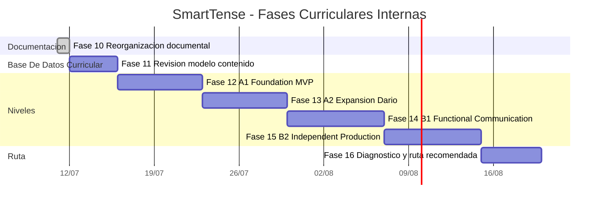

# SmartTense - Guia Curricular Por Niveles

Fecha base: 2026-07-11.

Este documento es la fuente oficial para planear el siguiente nivel de SmartTense. Su objetivo es convertir el documento `DARIO _ GENERAL ENGLISH COURSE.docx` en una ruta incremental de producto y desarrollo de software, sin dejar decisiones ambiguas para quien implemente.

## Alcance Del Documento Fuente

El documento revisado corresponde a un bloque A2:

- titulo general: `A2 English Level`;
- unidad principal: `Verb Tenses and Daily Habits`;
- contenido fuerte: Present Simple, Present Continuous, Present Perfect Simple, Present Perfect Continuous;
- soporte pedagogico: objetivos, estructuras, ejemplos, errores comunes, ejercicios, preposiciones, vocabulario, speaking y writing.

El documento no trae todo A1, B1 y B2 desarrollado. Por eso se usa como plantilla pedagogica, no como contenido completo. La expansion a otros niveles debe seguir la misma forma: objetivos claros, teoria corta, patrones, ejemplos, errores comunes, practica controlada y produccion.

## Principios Obligatorios

- Trabajar por fases cerrables. No se abre una fase nueva hasta cerrar la anterior con evidencia.
- Mantener el core actual de conjugacion. No duplicar motores gramaticales si el dato puede vivir en `learningUnits`.
- Priorizar mobile-first. Cada fase debe verse bien en `390x844`.
- Agregar contenido como datos primero. Cambios de UI solo cuando el flujo del usuario lo necesite.
- Validar todo contenido importable. Cualquier cambio de schema exige pruebas y documentacion.
- Mantener una sola fuente activa de planeacion: este documento, mas el estado real en `PHASE_EXECUTION_LOG.md`.

## Modelo Estandar De Unidad

Cada unidad nueva debe tener, como minimo:

| Bloque | Requisito operativo |
| --- | --- |
| Perfil | nivel CEFR, unidad, prerequisitos, objetivo del estudiante |
| Objetivos | 3 a 6 resultados observables |
| Teoria | explicacion breve, directa y apta para mobile |
| Estructuras | afirmativa, negativa, interrogativa y usos, cuando aplique |
| Ejemplos | ejemplos contextualizados por trabajo, vida diaria, familia, viajes o estudio |
| Errores comunes | errores esperados con correccion clara |
| Vocabulario | lista contextual reutilizable en Practice y Production |
| Ejercicios | fillBlank, transform, chooseTense, correctMistake, translation o variantes existentes |
| Produccion | prompts de speaking y writing alineados con la unidad |
| Evidencia | pruebas, build, smoke mobile y notas en `PHASE_EXECUTION_LOG.md` |

## Ruta Curricular Objetivo

| Nivel | Meta ejecutiva | Alcance pedagogico inicial |
| --- | --- | --- |
| A1 | Fundacion de comunicacion basica | be, have, pronombres, articulos, there is/are, present simple basico, objetos y rutinas simples |
| A2 | Rutinas, acciones en progreso y experiencias simples | presente simple, presente continuo, present perfect, preposiciones, habitos diarios, trabajo y familia |
| B1 | Comunicacion funcional en pasado, futuro y condicion | pasado simple/continuo/perfecto, futuros, condicional simple, experiencias, planes, narraciones y problemas cotidianos |
| B2 | Produccion independiente y combinacion avanzada | tiempos mixtos, pasiva, reported speech, condicionales, conectores, phrasal verbs, escritura y habla extendida |

## Fases Ejecutivas Y Tareas Operativas

### Fase 10 - Reorganizacion Documental Y Guia Curricular

**Objetivo ejecutivo:** dejar una base documental unica y estricta antes de programar nuevas pantallas o contenido curricular.

**Estado:** cerrada el 2026-07-11 con `npm run release:check` verde.

| Tarea operativa | Criterio de aceptacion |
| --- | --- |
| Crear `docs/INDEX.md` | El indice lista documentos activos, documentos consolidados y orden de lectura |
| Crear `docs/CURRICULUM_PHASE_PLAN.md` | Incluye A1, A2, B1, B2, fases ejecutivas, tareas operativas y Gantt interno |
| Consolidar planes antiguos | Los documentos redundantes se eliminan o dejan de referenciarse |
| Actualizar guias por rol | README, Developer, Junior, User, GitHub Pages y Release Checklist apuntan al plan oficial |
| Registrar evidencia | `PHASE_EXECUTION_LOG.md` declara Fase 10 y comandos ejecutados |

**Salida:** documentacion sin fuentes paralelas para el siguiente roadmap curricular.

### Fase 11 - Revision Del Modelo De Contenido

**Objetivo ejecutivo:** confirmar que `learningUnits` puede soportar niveles A1-B2 sin cambios apresurados de UI.

| Tarea operativa | Criterio de aceptacion |
| --- | --- |
| Auditar `public/data/learningUnits.json` | Se confirma si soporta nivel, prerequisitos, orden, contextos y ejercicios |
| Auditar `src/data/learningContentValidation.js` | Se documenta cualquier limite que bloquee A1-B2 |
| Proponer cambios minimos de schema | Solo se agregan campos si son necesarios para ruta por niveles |
| Actualizar pruebas de validacion | Casos validos e invalidos cubren el nuevo contrato |
| Actualizar `LEARNING_CONTENT_SCHEMA.md` | El schema queda explicado para autores de contenido |

**Salida:** contrato de datos listo para cargar A1 y A2 sin deuda oculta.

### Fase 12 - A1 Foundation MVP

**Objetivo ejecutivo:** construir el primer tramo A1 usable para estudiantes que empiezan desde cero.

| Tarea operativa | Criterio de aceptacion |
| --- | --- |
| Definir 3 a 5 unidades A1 | Cada unidad tiene objetivo, teoria, ejemplos, vocabulario, ejercicios y prompts |
| Cargar contenido A1 en JSON | `learningUnits` valida sin errores y mantiene IDs estables |
| Ajustar Home si hace falta | El estudiante entiende que A1 es el inicio recomendado |
| Probar Theory y Practice | Cada unidad abre en mobile, filtra contenido y mantiene scoring local |
| Agregar prompts Production A1 | Speaking/writing tiene tareas cortas y realistas |

**Salida:** ruta A1 inicial navegable desde Home, Theory, Practice y Production.

### Fase 13 - A2 Expansion Desde Documento Dario

**Objetivo ejecutivo:** convertir el documento A2 de Dario en unidades de app ordenadas, no en una sola pantalla pesada.

| Tarea operativa | Criterio de aceptacion |
| --- | --- |
| Dividir el documento en unidades pequenas | Present Simple, Present Continuous, Present Perfect, Prepositions y Daily Habits quedan separados o agrupados con criterio |
| Migrar teoria y estructuras | Cada tiempo tiene explicacion breve, patrones y ejemplos |
| Migrar ejercicios | Los ejercicios se adaptan al formato existente sin romper validacion |
| Agregar vocabulario y contextos | Daily habits, work/IT, family y movement/time/place quedan reutilizables |
| Agregar prompts de speaking/writing | Production refleja la unidad A2 activa |

**Salida:** A2 queda implementado como ruta curricular progresiva y comprobable.

### Fase 14 - B1 Functional Communication

**Objetivo ejecutivo:** permitir que el estudiante narre, planee y resuelva situaciones cotidianas con tiempos basicos extendidos.

| Tarea operativa | Criterio de aceptacion |
| --- | --- |
| Definir mapa B1 | Pasados, futuros, condicional simple, experiencias y narraciones tienen orden pedagogico |
| Crear unidades B1 iniciales | Cada unidad cumple el modelo estandar |
| Agregar ejercicios de decision de tiempo | Practice compara tiempos y fuerza razonamiento contextual |
| Agregar prompts de problemas reales | Production cubre trabajo, viajes, reuniones, errores y soluciones |
| Revisar progreso por unidad | Home recomienda siguiente paso sin sobrecargar mobile |

**Salida:** B1 inicial con transferencia entre tiempos y produccion guiada.

### Fase 15 - B2 Independent Production

**Objetivo ejecutivo:** pasar de ejercicios controlados a produccion independiente y revision mas exigente.

| Tarea operativa | Criterio de aceptacion |
| --- | --- |
| Definir mapa B2 | Mixed tenses, passive, reported speech, conditionals y connectors tienen ruta |
| Crear unidades B2 iniciales | Teoria y ejercicios evitan saturacion visual en mobile |
| Mejorar rubricas de Production | Speaking/writing evalua claridad, precision, variedad y coherencia |
| Agregar ejercicios de correccion avanzada | El estudiante identifica errores de forma, tiempo y registro |
| Revisar densidad de UI | Smoke mobile sigue verde y sin overflow critico |

**Salida:** B2 inicial orientado a produccion, no solo conjugacion.

### Fase 16 - Diagnostico Y Ruta Recomendada

**Objetivo ejecutivo:** ayudar al estudiante a saber por donde empezar y que practicar despues.

| Tarea operativa | Criterio de aceptacion |
| --- | --- |
| Definir diagnostico MVP | Preguntas cortas detectan nivel sugerido sin cuenta ni servidor |
| Guardar recomendacion local | La recomendacion vive en localStorage con opcion de reset |
| Conectar Home con ruta | Home muestra siguiente unidad segun diagnostico y progreso |
| Documentar experiencia de usuario | USER_GUIDE explica diagnostico, progreso y privacidad |
| Validar mobile y accesibilidad | `npm run release:check` verde |

**Salida:** ruta recomendada local, simple y verificable.

## Gantt Interno

Las fechas son internas y orientativas. La duracion real se ajusta al cerrar cada fase con evidencia.

## Definicion De Hecho Por Fase

Una fase solo se considera cerrada cuando cumple todo:

- tareas operativas marcadas como completadas;
- documentacion actualizada;
- `npm run release:check` verde o bloqueo documentado;
- evidencia escrita en `PHASE_EXECUTION_LOG.md`;
- sin referencias activas a documentos obsoletos;
- siguiente fase definida con alcance limitado.

## Bloqueos Que Deben Detener Implementacion

- No existe criterio de salida medible.
- El cambio exige nuevo schema pero no hay prueba de validacion.
- El contenido no cabe o no se entiende en mobile.
- La fase mezcla contenido, UI, diagnostico y refactor sin prioridad clara.
- Hay dos documentos dando instrucciones distintas para la misma fase.
