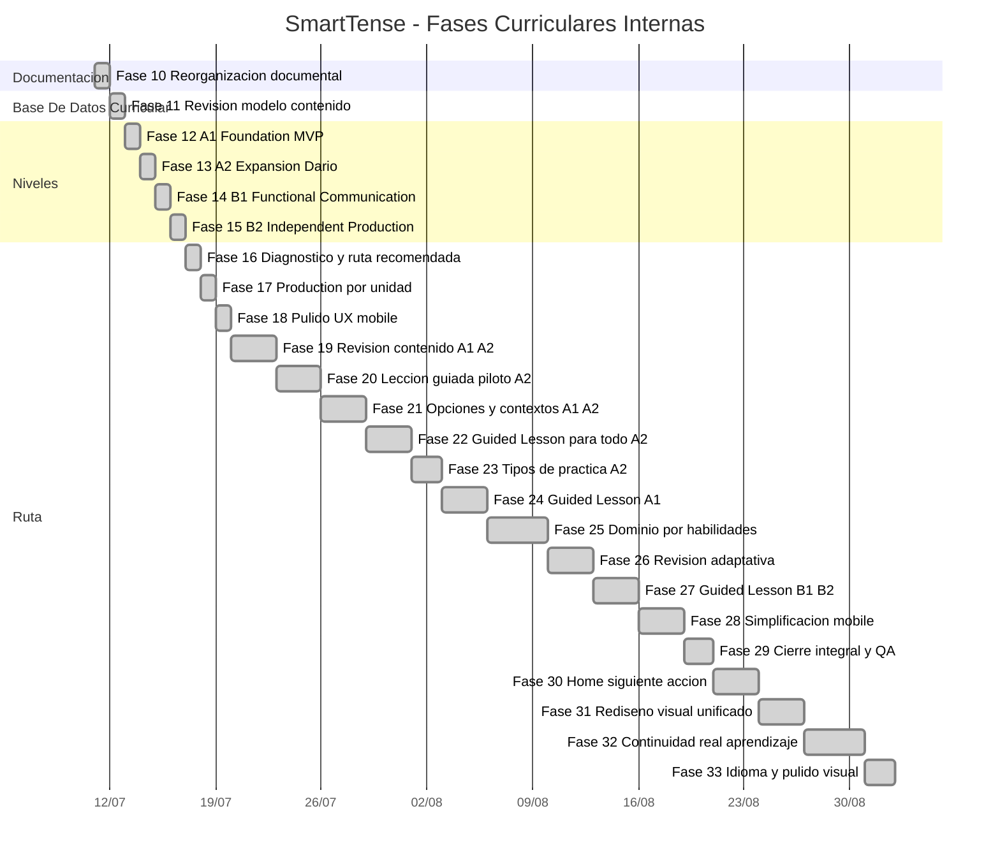

# SmartTense - Guia Curricular Por Niveles

Fecha base: 2026-07-11.

Este documento es la fuente oficial para planear el siguiente nivel de SmartTense. Su objetivo es convertir el documento `DARIO _ GENERAL ENGLISH COURSE.docx` en una ruta incremental de producto y desarrollo de software, sin dejar decisiones ambiguas para quien implemente.

Para el detalle operativo de desarrollo, historias de usuario, requerimientos funcionales/no funcionales y criterios de aceptacion, usar `SOFTWARE_REQUIREMENTS.md`.

## Alcance Del Documento Fuente

El documento revisado corresponde a un bloque A2:

- titulo general: `A2 English Level`;
- unidad principal: `Verb Tenses and Daily Habits`;
- contenido fuerte: Present Simple, Present Continuous, Present Perfect Simple, Present Perfect Continuous;
- soporte pedagogico: objetivos, estructuras, ejemplos, errores comunes, ejercicios, preposiciones, vocabulario, speaking y writing.

El documento no trae todo A1, B1 y B2 desarrollado. Por eso se usa como plantilla pedagogica, no como contenido completo. La expansion a otros niveles debe seguir la misma forma: objetivos claros, teoria corta, patrones, ejemplos, errores comunes, practica controlada y produccion.

## Principios Obligatorios

- Trabajar por fases cerrables. No se abre una fase nueva hasta cerrar la anterior con evidencia.
- Mantener el core actual de conjugacion. No duplicar motores gramaticales si el dato puede vivir en `learningUnits`.
- Priorizar mobile-first. Cada fase debe verse bien en `390x844`.
- Agregar contenido como datos primero. Cambios de UI solo cuando el flujo del usuario lo necesite.
- Validar todo contenido importable. Cualquier cambio de schema exige pruebas y documentacion.
- Mantener una sola fuente activa de planeacion: este documento, mas el estado real en `PHASE_EXECUTION_LOG.md`.
- Antes de programar, confirmar los requerimientos relacionados en `SOFTWARE_REQUIREMENTS.md`.

## Modelo Estandar De Unidad

Cada unidad nueva debe tener, como minimo:

| Bloque | Requisito operativo |
| --- | --- |
| Perfil | nivel CEFR, unidad, prerequisitos, objetivo del estudiante |
| Objetivos | 3 a 6 resultados observables |
| Teoria | explicacion breve, directa y apta para mobile |
| Estructuras | afirmativa, negativa, interrogativa y usos, cuando aplique |
| Ejemplos | ejemplos contextualizados por trabajo, vida diaria, familia, viajes o estudio |
| Errores comunes | errores esperados con correccion clara |
| Vocabulario | lista contextual reutilizable en Practice y Production |
| Ejercicios | fillBlank, transform, chooseTense, correctMistake, translation o variantes existentes |
| Produccion | prompts de speaking y writing alineados con la unidad |
| Evidencia | pruebas, build, smoke mobile y notas en `PHASE_EXECUTION_LOG.md` |

## Ruta Curricular Objetivo

| Nivel | Meta ejecutiva | Alcance pedagogico inicial |
| --- | --- | --- |
| A1 | Fundacion de comunicacion basica | be, have, pronombres, articulos, there is/are, present simple basico, objetos y rutinas simples |
| A2 | Rutinas, acciones en progreso y experiencias simples | presente simple, presente continuo, present perfect, preposiciones, habitos diarios, trabajo y familia |
| B1 | Comunicacion funcional en pasado, futuro y condicion | pasado simple/continuo/perfecto, futuros, condicional simple, experiencias, planes, narraciones y problemas cotidianos |
| B2 | Produccion independiente y combinacion avanzada | tiempos mixtos, pasiva, reported speech, condicionales, conectores, phrasal verbs, escritura y habla extendida |

## Fases Ejecutivas Y Tareas Operativas

### Fase 10 - Reorganizacion Documental Y Guia Curricular

**Objetivo ejecutivo:** dejar una base documental unica y estricta antes de programar nuevas pantallas o contenido curricular.

**Estado:** cerrada el 2026-07-11 con `npm run release:check` verde.

| Tarea operativa | Criterio de aceptacion |
| --- | --- |
| Crear `docs/INDEX.md` | El indice lista documentos activos, documentos consolidados y orden de lectura |
| Crear `docs/CURRICULUM_PHASE_PLAN.md` | Incluye A1, A2, B1, B2, fases ejecutivas, tareas operativas y Gantt interno |
| Consolidar planes antiguos | Los documentos redundantes se eliminan o dejan de referenciarse |
| Actualizar guias por rol | README, Developer, Junior, User, GitHub Pages y Release Checklist apuntan al plan oficial |
| Registrar evidencia | `PHASE_EXECUTION_LOG.md` declara Fase 10 y comandos ejecutados |

**Salida:** documentacion sin fuentes paralelas para el siguiente roadmap curricular.

### Fase 11 - Revision Del Modelo De Contenido

**Objetivo ejecutivo:** confirmar que `learningUnits` puede soportar niveles A1-B2 sin cambios apresurados de UI.

**Estado:** cerrada localmente con schema v3, metadata curricular y `npm run release:check` verde.

| Tarea operativa | Criterio de aceptacion |
| --- | --- |
| Auditar `public/data/learningUnits.json` | Se confirma si soporta nivel, prerequisitos, orden, contextos y ejercicios |
| Auditar `src/data/learningContentValidation.js` | Se documenta cualquier limite que bloquee A1-B2 |
| Proponer cambios minimos de schema | Solo se agregan campos si son necesarios para ruta por niveles |
| Actualizar pruebas de validacion | Casos validos e invalidos cubren el nuevo contrato |
| Actualizar `LEARNING_CONTENT_SCHEMA.md` | El schema queda explicado para autores de contenido |

**Salida:** contrato de datos listo para cargar A1 y A2 sin deuda oculta. Schema v3 usa `cefrLevel`, `unitOrder` y `prerequisiteUnitIds`.

### Fase 12 - A1 Foundation MVP

**Objetivo ejecutivo:** construir el primer tramo A1 usable para estudiantes que empiezan desde cero.

**Estado:** cerrada localmente. MVP minimo de 3 unidades A1 entregado con `be-have-foundation`, `present-simple-foundation` y `personal-information-questions`.

| Tarea operativa | Criterio de aceptacion |
| --- | --- |
| Definir 3 a 5 unidades A1 | Cada unidad tiene objetivo, teoria, ejemplos, vocabulario, ejercicios y prompts |
| Cargar contenido A1 en JSON | `learningUnits` valida sin errores y mantiene IDs estables |
| Ajustar Home si hace falta | El estudiante entiende que A1 es el inicio recomendado |
| Probar Theory y Practice | Cada unidad abre en mobile, filtra contenido y mantiene scoring local |
| Agregar prompts Production A1 | Speaking/writing tiene tareas cortas y realistas |

**Salida:** ruta A1 inicial navegable desde Home, Theory, Practice y Production.

### Fase 13 - A2 Expansion Desde Documento Dario

**Objetivo ejecutivo:** convertir el documento A2 de Dario en unidades de app ordenadas, no en una sola pantalla pesada.

**Estado:** cerrada localmente. Se agregaron unidades A2 para Present Continuous, Present Perfect, Present Perfect Continuous y Prepositions/Daily Habits.

| Tarea operativa | Criterio de aceptacion |
| --- | --- |
| Dividir el documento en unidades pequenas | Present Simple, Present Continuous, Present Perfect, Prepositions y Daily Habits quedan separados o agrupados con criterio |
| Migrar teoria y estructuras | Cada tiempo tiene explicacion breve, patrones y ejemplos |
| Migrar ejercicios | Los ejercicios se adaptan al formato existente sin romper validacion |
| Agregar vocabulario y contextos | Daily habits, work/IT, family y movement/time/place quedan reutilizables |
| Agregar prompts de speaking/writing | Production refleja la unidad A2 activa |

**Salida:** A2 queda implementado como ruta curricular progresiva y comprobable.

### Fase 14 - B1 Functional Communication

**Objetivo ejecutivo:** permitir que el estudiante narre, planee y resuelva situaciones cotidianas con tiempos basicos extendidos.

**Estado:** cerrada localmente. Se fortalecio B1 con `past-future-conditional-foundation` y `b1-narratives-plans-problems`.

| Tarea operativa | Criterio de aceptacion |
| --- | --- |
| Definir mapa B1 | Pasados, futuros, condicional simple, experiencias y narraciones tienen orden pedagogico |
| Crear unidades B1 iniciales | Cada unidad cumple el modelo estandar |
| Agregar ejercicios de decision de tiempo | Practice compara tiempos y fuerza razonamiento contextual |
| Agregar prompts de problemas reales | Production cubre trabajo, viajes, reuniones, errores y soluciones |
| Revisar progreso por unidad | Home recomienda siguiente paso sin sobrecargar mobile |

**Salida:** B1 inicial con transferencia entre tiempos y produccion guiada.

### Fase 15 - B2 Independent Production

**Objetivo ejecutivo:** pasar de ejercicios controlados a produccion independiente y revision mas exigente.

**Estado:** cerrada localmente. Se agrego la unidad inicial `b2-mixed-tenses-independent-production` con prompts B2.

| Tarea operativa | Criterio de aceptacion |
| --- | --- |
| Definir mapa B2 | Mixed tenses, passive, reported speech, conditionals y connectors tienen ruta |
| Crear unidades B2 iniciales | Teoria y ejercicios evitan saturacion visual en mobile |
| Mejorar rubricas de Production | Speaking/writing evalua claridad, precision, variedad y coherencia |
| Agregar ejercicios de correccion avanzada | El estudiante identifica errores de forma, tiempo y registro |
| Revisar densidad de UI | Smoke mobile sigue verde y sin overflow critico |

**Salida:** B2 inicial orientado a produccion, no solo conjugacion.

### Fase 16 - Diagnostico Y Ruta Recomendada

**Objetivo ejecutivo:** ayudar al estudiante a saber por donde empezar y que practicar despues.

**Estado:** cerrada localmente. Home incluye diagnostico CEFR local y puede aplicar una unidad recomendada.

| Tarea operativa | Criterio de aceptacion |
| --- | --- |
| Definir diagnostico MVP | Preguntas cortas detectan nivel sugerido sin cuenta ni servidor |
| Guardar recomendacion local | La recomendacion vive en localStorage con opcion de reset |
| Conectar Home con ruta | Home muestra siguiente unidad segun diagnostico y progreso |
| Documentar experiencia de usuario | USER_GUIDE explica diagnostico, progreso y privacidad |
| Validar mobile y accesibilidad | `npm run release:check` verde |

**Salida:** ruta recomendada local, simple y verificable.

### Fase 17 - Production Por Unidad Y Revision Guiada

**Objetivo ejecutivo:** hacer que Production acompane mejor la ruta activa sin perder el modo global actual.

**Estado:** cerrada localmente. Production muestra prompts sugeridos por unidad y conserva la vista global.

| Tarea operativa | Criterio de aceptacion |
| --- | --- |
| Definir filtro de prompts por unidad o CEFR | La decision queda documentada y no rompe intentos existentes |
| Mantener Production global como fallback | El usuario puede seguir viendo todos los prompts cuando lo necesite |
| Mostrar prompts sugeridos segun ruta | La unidad activa tiene tareas de speaking/writing mas faciles de encontrar |
| Revisar cola de intentos | Los filtros no esconden intentos sin forma de recuperarlos |
| Validar mobile y documentacion | `npm run release:check` verde |

**Salida:** Production queda alineado con la ruta sin perder flexibilidad.

### Fase 18 - Pulido UX Mobile MVP

**Objetivo ejecutivo:** revisar densidad visual despues de agregar A1-B2, diagnostico y Production guiado.

**Estado:** cerrada localmente. Home incluye filtro segmentado `All/A1/A2/B1/B2` para orientar la ruta.

| Tarea operativa | Criterio de aceptacion |
| --- | --- |
| Revisar Home y Production en mobile | No hay controles redundantes ni texto excesivo en `390x844` |
| Ajustar copy o agrupacion visual minima | Se ahorra espacio sin cambiar funcionalidad |
| Confirmar Settings y tablas | La administracion sigue usable con 500 verbos sinteticos |
| Ejecutar release check | `npm run release:check` verde |

**Salida:** experiencia mobile mas liviana sin ampliar alcance funcional.

### Fase 19 - Revision De Contenido Y Gaps A1-A2

**Objetivo ejecutivo:** revisar si el MVP A1/A2 necesita mas contenido antes de seguir expandiendo niveles superiores.

**Estado:** cerrada el 2026-07-21 con auditoria automatica, backlog priorizado y puerta de calidad A1/A2.

| Tarea operativa | Criterio de aceptacion |
| --- | --- |
| Revisar cobertura A1 | Se identifican gaps sin cambiar schema |
| Revisar cobertura A2 | Se identifican gaps desde el documento de Dario y uso actual |
| Priorizar mejoras pequenas | Se proponen tareas de contenido cerrables |
| Mantener estabilidad | No se rompe ruta A1 -> A2 -> B1 -> B2 |

**Salida:** backlog de contenido A1/A2 priorizado.

**Resultado:** se creo `CONTENT_GAPS_A1_A2.md`, se agrego `npm run audit:content` y se cubrieron con pruebas los errores bloqueantes de opciones duplicadas o respuestas ausentes. Los gaps contextuales y metodologicos quedan como warnings accionables para la siguiente fase.

### Fase 20 - Modelo De Leccion Guiada Y Piloto A2

**Objetivo ejecutivo:** convertir una unidad A2 existente en un recorrido corto y guiado para telefono, usando la metodologia Dario como secuencia de aprendizaje.

**Estado:** cerrada el 2026-07-21 con piloto Present Continuous A2, pruebas y smoke mobile verde.

| Tarea operativa | Criterio de aceptacion |
| --- | --- |
| Elegir unidad piloto | Present Continuous A2 queda definida como primer recorrido sin alterar prerequisitos |
| Activar metodologia | La unidad usa learnerContext, pronunciationDrills y productionTask validados |
| Crear recorrido guiado | El estudiante avanza por objetivo, teoria, ejemplo, practica, correccion y produccion |
| Reducir densidad mobile | Se presenta una actividad principal a la vez en 390x844 |
| Conservar compatibilidad | Theory y Practice actuales siguen disponibles durante la migracion |
| Cerrar con evidencia | Auditoria, pruebas, build y smoke mobile quedan verdes |

**Salida:** una unidad A2 completa funciona como leccion guiada reutilizando el contenido actual.

**Resultado:** Theory ofrece `Start guided lesson` para Present Continuous A2. El recorrido presenta una actividad por paso: objetivos, teoria, ejemplos, tres practicas, correccion, pronunciacion, produccion y resumen. La unidad activa `learnerContext`, `pronunciationDrills` y `productionTask` sin duplicar ejercicios.

### Fase 21 - Opciones Curadas Y Cobertura Contextual A1-A2

**Objetivo ejecutivo:** eliminar dependencias innecesarias de opciones generadas y cerrar los gaps contextuales detectados por la auditoria.

**Estado:** cerrada el 2026-07-21 con opciones curadas, 131 ejercicios y 0 gaps contextuales.

| Tarea operativa | Criterio de aceptacion |
| --- | --- |
| Curar opciones faltantes | Transform y Translation prioritarios guardan distractores pedagogicos cuando el formato lo permite |
| Completar Present Simple | Meetings y Family Routines alcanzan 5 ejercicios o dejan de mostrarse como contextos parciales |
| Completar Family Routines A2 | Present Perfect, Present Perfect Continuous y Prepositions alcanzan 5 ejercicios |
| Corregir metadata contextual | Cada contexto usado por ejercicios se declara en la unidad correspondiente |
| Reducir warnings | `npm run audit:content` mantiene 0 errores y elimina los 5 gaps contextuales |
| Cerrar con evidencia | Pruebas, build y smoke mobile quedan verdes |

**Salida:** Practice ofrece selecciones curadas y filtros contextuales completos en A1/A2.

**Resultado:** se agregaron opciones pedagogicas a todos los ejercicios A1/A2 que dependian del fallback, se incorporaron 19 ejercicios y se declararon los contextos realmente usados. Meetings y Family Routines alcanzan el minimo de 5 ejercicios en las unidades donde aparecen.

### Fase 22 - Extender Guided Lesson A Todo A2

**Objetivo ejecutivo:** aplicar el recorrido guiado validado a Present Perfect, Present Perfect Continuous y Prepositions/Daily Habits.

**Estado:** cerrada el 2026-07-21 con las cuatro unidades A2 disponibles como Guided Lesson.

| Tarea operativa | Criterio de aceptacion |
| --- | --- |
| Activar metodologia en Present Perfect | La unidad define contexto, pronunciacion y produccion final |
| Activar metodologia en Present Perfect Continuous | La unidad practica duracion, for/since y produccion contextual |
| Activar metodologia en Prepositions | La unidad integra tiempo, lugar, movimiento y produccion diaria |
| Adaptar la secuencia por contenido | Guided Lesson omite o adapta pasos sin mostrar tarjetas vacias |
| Mantener una actividad por pantalla | Las tres unidades funcionan sin overflow en `390x844` |
| Cerrar con evidencia | Auditoria, pruebas, build y smoke mobile quedan verdes |

**Salida:** las cuatro unidades A2 ofrecen una leccion guiada coherente desde Theory.

**Resultado:** Present Continuous, Present Perfect, Present Perfect Continuous y Prepositions/Daily Habits activan contexto del estudiante, pronunciacion y produccion final. El smoke mobile selecciona y abre las cuatro unidades desde el Home real.

### Fase 23 - Completar Tipos De Practica A2

**Objetivo ejecutivo:** asegurar que cada unidad A2 cubra los tipos de practica necesarios para transferencia, correccion y produccion controlada.

**Estado:** cerrada el 2026-07-21 con los cinco tipos de practica presentes en cada unidad A2.

| Tarea operativa | Criterio de aceptacion |
| --- | --- |
| Completar Present Continuous | Agregar correctMistake y translation con opciones curadas |
| Completar Present Perfect | Agregar chooseTense contextualizado |
| Completar Present Perfect Continuous | Agregar correctMistake con for/since o estructura completa |
| Completar Prepositions | Agregar transform y chooseTense para tiempo, lugar y movimiento |
| Mantener calidad | La auditoria A1/A2 conserva 0 errores y 0 gaps contextuales |
| Cerrar con evidencia | Pruebas, build y smoke mobile quedan verdes |

**Salida:** cada unidad A2 contiene fillBlank, transform, chooseTense, correctMistake y translation.

**Resultado:** se agregaron 6 ejercicios con opciones curadas. El banco A1/A2 alcanza 137 ejercicios y los warnings de auditoria bajan de 9 a 5; ningun warning restante corresponde a una unidad A2.

### Fase 24 - Guided Lesson A1 Simplificada

**Objetivo ejecutivo:** ofrecer a estudiantes principiantes un recorrido guiado con mas repeticion, instrucciones cortas y menor carga de contraste.

**Estado:** cerrada el 2026-07-21 con las tres unidades A1 disponibles como Guided Lesson.

| Tarea operativa | Criterio de aceptacion |
| --- | --- |
| Activar Be and Have | Agregar contexto, pronunciacion y produccion basica |
| Activar Present Simple A1 | Guiar rutinas con tercera persona y preguntas simples |
| Activar Personal Information | Practicar preguntas y respuestas personales cortas |
| Adaptar Guided Lesson a A1 | Copy y carga de pasos son apropiados para principiantes |
| Completar practica A1 pendiente | Be and Have incorpora translation con opciones curadas |
| Cerrar con evidencia | Auditoria, pruebas, build y smoke mobile quedan verdes |

**Salida:** las tres unidades A1 ofrecen Guided Lesson desde Theory con una progresion apropiada para principiantes.

**Resultado:** A1 activa contexto, pronunciacion y produccion en sus tres unidades. Se agrega la traduccion pendiente de Be and Have y se clasifica correctamente el ejercicio compartido de despliegues. La auditoria A1/A2 queda en 0 errores y 0 warnings.

### Fase 25 - Dominio Por Habilidades

**Objetivo ejecutivo:** registrar que estructuras domina el estudiante y cuales necesita revisar, mas alla del estado general de la unidad.

**Estado:** cerrada el 2026-07-21 con dominio local por habilidad integrado en Practice y Guided Lesson.

| Tarea operativa | Criterio de aceptacion |
| --- | --- |
| Definir catalogo de habilidades | A1/A2 mapea ejercicios a habilidades estables |
| Calcular dominio | Cada respuesta actualiza intentos, aciertos y nivel de dominio |
| Persistir localmente | El progreso por habilidad sobrevive recargas sin servidor |
| Mantener compatibilidad | El progreso actual por unidad sigue funcionando |
| Mostrar resumen util | Home o Progress muestra fortalezas y habilidad prioritaria |
| Cerrar con evidencia | Pruebas, build y smoke mobile quedan verdes |

**Salida:** SmartTense recomienda practica usando evidencia por habilidad.

**Resultado:** se definio un catalogo de 23 habilidades A1-B2. Cada respuesta registra intentos, aciertos, racha, dominio, ultima practica y proxima revision. Home muestra el foco prioritario y el promedio, y Settings reinicia el alcance global o solo las habilidades de la unidad activa.

### Fase 26 - Revision Adaptativa

**Objetivo ejecutivo:** convertir el progreso por habilidad en una sesion corta que prioriza lo que el estudiante necesita ahora.

**Estado:** cerrada el 2026-07-21 con recorrido adaptativo de una pregunta por pantalla.

| Tarea operativa | Criterio de aceptacion |
| --- | --- |
| Construir cola adaptativa | Se priorizan habilidades debiles, nuevas o vencidas |
| Evitar repeticion temprana | La primera ronda alterna habilidades antes de repetirlas |
| Mantener formato mobile | Se presenta una pregunta, feedback y accion principal por pantalla |
| Registrar resultados | Cada respuesta actualiza el mismo dominio usado por Practice |
| Mostrar cierre util | La sesion resume aciertos y confirma que el foco fue actualizado |
| Cerrar con evidencia | Pruebas, build y smoke mobile quedan verdes |

**Salida:** Home abre un repaso corto y personalizado sin duplicar contenido.

**Resultado:** `Adaptive Review` arma hasta ocho preguntas reutilizando ejercicios con opciones curadas, explica por que se selecciono cada habilidad y guarda el resultado localmente.

### Fase 27 - Guided Lesson B1-B2

**Objetivo ejecutivo:** extender la metodologia de contexto, pronunciacion y produccion guiada a los niveles intermedio y avanzado.

**Estado:** cerrada el 2026-07-21 con las tres unidades B1/B2 activas.

| Tarea operativa | Criterio de aceptacion |
| --- | --- |
| Activar B1 foundation | Integra secuencia temporal, futuros y condicionales |
| Activar B1 narratives | Integra historias, problemas y planes |
| Activar B2 mixed tenses | Integra reported speech, pasiva y precision entre tiempos |
| Mapear habilidades avanzadas | El dominio y el repaso reconocen focos B1/B2 |
| Mantener ruta completa | Guided Lesson funciona en las 10 unidades A1-B2 |
| Cerrar con evidencia | Pruebas, build y smoke mobile quedan verdes |

**Salida:** la metodologia guiada cubre toda la ruta curricular disponible.

**Resultado:** B1 y B2 incorporan `learnerContext`, dos ejercicios de pronunciacion y una tarea de produccion con estructuras requeridas y checklist por unidad.

### Fase 28 - Simplificacion Mobile De Home Y Navegacion

**Objetivo ejecutivo:** reducir decisiones y densidad en telefono sin retirar herramientas avanzadas.

**Estado:** cerrada el 2026-07-21 con Home enfocado y cuatro destinos primarios.

| Tarea operativa | Criterio de aceptacion |
| --- | --- |
| Reducir Home | La vista movil prioriza unidad, continuar, progreso y recomendacion |
| Crear navegacion primaria | Inicio, Teoria, Practica y Repaso quedan siempre accesibles |
| Conservar herramientas | Produccion, tablas, Settings y documentacion siguen en el menu lateral |
| Respetar accesibilidad | Navegacion nombrada, botones claros y targets tactiles suficientes |
| Evitar overflow | Home, barra inferior y Guided Lesson caben en 390x844 |
| Cerrar con evidencia | Smoke mobile recorre todas las pantallas criticas |

**Salida:** el flujo principal requiere menos exploracion y menos desplazamiento en telefono.

**Resultado:** Home movil oculta informacion redundante, ofrece `Continue lesson` y usa una barra inferior de cuatro opciones. El menu completo sigue disponible desde el boton superior.

### Fase 29 - Cierre Integral Y QA A1-B2

**Objetivo ejecutivo:** consolidar documentacion, auditoria y evidencia de entrega de todas las fases metodologicas.

**Estado:** cerrada el 2026-07-21.

| Tarea operativa | Criterio de aceptacion |
| --- | --- |
| Ampliar auditoria | `npm run audit:content` revisa A1, A2, B1 y B2 |
| Actualizar guias | Usuario y desarrollador documentan Guided Lesson, dominio y Repaso |
| Actualizar roadmap | Fases 25-29 quedan cerradas con resultados medibles |
| Ejecutar pruebas | Suite unitaria completa queda verde |
| Ejecutar build | Vite produce el artefacto sin errores |
| Ejecutar E2E | Mobile cubre Home, Guided Lesson, Repaso y herramientas principales |

**Salida:** una linea base curricular y tecnica lista para la siguiente decision de producto.

**Resultado:** 10 unidades guiadas, 213 ejercicios sin warnings de calidad, seguimiento por 23 habilidades, repaso adaptativo y navegacion mobile simplificada quedan integrados y documentados.

### Fase 30 - Home Orientado A La Siguiente Accion

**Objetivo ejecutivo:** reemplazar el Home movil basado en configuracion por una experiencia que indique claramente que hacer ahora.

**Estado:** cerrada el 2026-07-21 con Home, Course y Progress separados por intencion.

| Tarea operativa | Criterio de aceptacion |
| --- | --- |
| Simplificar Home | Solo muestra continuar, siguiente repaso y progreso A1-B2 |
| Crear Course | Niveles y unidades viven en una pantalla navegable |
| Crear Progress | Dominio y avance dejan de competir con la accion principal |
| Reordenar navegacion | Mobile usa Home, Course, Practice y Progress |
| Conservar herramientas | Theory, Review, Production y Settings siguen disponibles |
| Cerrar con evidencia | Pruebas, build y recorrido mobile quedan verdes |

**Salida:** el estudiante puede continuar aprendiendo sin comprender primero la arquitectura interna de SmartTense.

**Resultado:** Home movil presenta una accion primaria, un repaso corto y el avance por nivel. Course permite abrir cualquiera de las 10 unidades y Progress concentra dominio promedio, habilidad prioritaria y progreso curricular.

### Fase 31 - Rediseno Visual Unificado

**Objetivo ejecutivo:** aplicar una jerarquia grafica consistente al Home en telefono y escritorio sin volver a modificar metodologia o contenido.

**Estado:** cerrada el 2026-07-21 con Home orientado a la accion en ambos tamaños.

| Tarea operativa | Criterio de aceptacion |
| --- | --- |
| Unificar Home | Escritorio y mobile presentan la misma informacion prioritaria |
| Reforzar accion principal | Continue lesson domina visualmente la primera pantalla |
| Reducir competencia | Review y progreso usan jerarquia secundaria clara |
| Visualizar ruta | A1-B2 se presenta como secuencia, no como estadisticas aisladas |
| Preservar diagnostico | Solo aparece mientras esta pendiente |
| Validar responsive | QA cubre 390x844 y Home desktop 1280x900 |

**Salida:** una experiencia de inicio coherente, reconocible y enfocada en aprendizaje.

**Resultado:** se adopta una direccion visual verde profundo, terracota, crema y dorado; tipografia editorial para titulos; tarjetas asimetricas; progreso secuencial y dashboard anterior oculto en todos los tamaños.

### Fase 32 - Continuidad Real Del Aprendizaje

**Objetivo ejecutivo:** recordar exactamente donde quedo el estudiante y conducirlo desde Guided Lesson hasta la siguiente unidad.

**Estado:** cerrada el 2026-07-21 con progreso persistente, Practice enfocada, Production integrada y onboarding.

| Tarea operativa | Criterio de aceptacion |
| --- | --- |
| Persistir Guided Lesson | Paso, respuestas, verificaciones y borrador sobreviven recargas |
| Calcular progreso real | Guided, Practice y Production aportan porcentajes medibles |
| Reanudar exactamente | Continue Lesson abre el ultimo paso guardado |
| Enfocar Practice | Solo una pregunta y una accion principal son visibles |
| Completar flujo | Production guardada completa la unidad y prepara la siguiente |
| Clarificar Course | Estados, recomendacion y prerrequisitos son visibles |
| Crear onboarding | Primera visita ofrece diagnostico corto o inicio desde A1 |

**Salida:** el estudiante puede cerrar la aplicacion, volver y continuar sin reconstruir manualmente su recorrido.

**Resultado:** `journeyProgress` guarda el estado por unidad. El progreso usa 60% Guided Lesson, 30% Practice y 10% Production. Course distingue Completed, In progress, Recommended y Requires previous unit. El onboarding desaparece una vez aplicado o elegido A1.

### Fase 33 - Consistencia De Idioma Y Pulido Visual

**Objetivo ejecutivo:** hacer que la ruta principal se lea y se reconozca con claridad tanto en ingles como en espanol, especialmente en telefonos.

**Estado:** cerrada el 2026-07-21 con interfaz bilingue ampliada y sistema visual accesible.

| Tarea operativa | Criterio de aceptacion |
| --- | --- |
| Unificar idioma | Guided Lesson, Adaptive Review, Practice y Home no exponen etiquetas tecnicas sin traducir |
| Mejorar tipografia | Atkinson Hyperlegible se sirve localmente como fuente principal |
| Unificar iconografia | La navegacion y acciones principales usan SVG coherentes y accesibles |
| Reducir ruido | Etiquetas editoriales dejan de depender de mayusculas sostenidas |
| Reforzar legibilidad | Textos secundarios ganan contraste sobre fondos claros |
| Agregar movimiento util | Entradas cortas guian la atencion y respetan `prefers-reduced-motion` |
| Celebrar avance | Completar una unidad muestra confirmacion discreta y la siguiente unidad |

**Salida:** una experiencia mas clara, consistente y reconocible sin cambiar el modelo curricular ni el flujo de aprendizaje.

**Resultado:** textos de interfaz cubiertos en ingles y espanol, tipografia local, iconos SVG reutilizables, microtransiciones accesibles y confirmacion visual al completar unidades.

## Gantt Interno

```mermaid
gantt
    title SmartTense - Fases Curriculares Internas
    dateFormat  YYYY-MM-DD
    axisFormat  %d/%m

    section Documentacion
    Fase 10 Reorganizacion documental       :done, f10, 2026-07-11, 1d

    section Base De Datos Curricular
    Fase 11 Revision modelo contenido        :done, f11, after f10, 1d

    section Niveles
    Fase 12 A1 Foundation MVP                :done, f12, after f11, 1d
    Fase 13 A2 Expansion Dario               :done, f13, after f12, 1d
    Fase 14 B1 Functional Communication      :done, f14, after f13, 1d
    Fase 15 B2 Independent Production        :done, f15, after f14, 1d

    section Ruta
    Fase 16 Diagnostico y ruta recomendada   :done, f16, after f15, 1d
    Fase 17 Production por unidad            :done, f17, after f16, 1d
    Fase 18 Pulido UX mobile                 :done, f18, after f17, 1d
    Fase 19 Revision contenido A1 A2         :done, f19, after f18, 3d
    Fase 20 Leccion guiada piloto A2         :done, f20, after f19, 3d
    Fase 21 Opciones y contextos A1 A2        :done, f21, after f20, 3d
    Fase 22 Guided Lesson para todo A2         :done, f22, after f21, 3d
    Fase 23 Tipos de practica A2               :done, f23, after f22, 2d
    Fase 24 Guided Lesson A1                   :done, f24, after f23, 3d
    Fase 25 Dominio por habilidades            :done, f25, after f24, 4d
    Fase 26 Revision adaptativa                 :done, f26, after f25, 3d
    Fase 27 Guided Lesson B1 B2                 :done, f27, after f26, 3d
    Fase 28 Simplificacion mobile               :done, f28, after f27, 3d
    Fase 29 Cierre integral y QA                :done, f29, after f28, 2d
    Fase 30 Home siguiente accion               :done, f30, after f29, 3d
    Fase 31 Rediseno visual unificado            :done, f31, after f30, 3d
    Fase 32 Continuidad real aprendizaje         :done, f32, after f31, 4d
    Fase 33 Idioma y pulido visual                :done, f33, after f32, 2d
```

Las fechas son internas y orientativas. La duracion real se ajusta al cerrar cada fase con evidencia.

## Definicion De Hecho Por Fase

Una fase solo se considera cerrada cuando cumple todo:

- tareas operativas marcadas como completadas;
- documentacion actualizada;
- `npm run release:check` verde o bloqueo documentado;
- evidencia escrita en `PHASE_EXECUTION_LOG.md`;
- sin referencias activas a documentos obsoletos;
- siguiente fase definida con alcance limitado.

## Bloqueos Que Deben Detener Implementacion

- No existe criterio de salida medible.
- El cambio exige nuevo schema pero no hay prueba de validacion.
- El contenido no cabe o no se entiende en mobile.
- La fase mezcla contenido, UI, diagnostico y refactor sin prioridad clara.
- Hay dos documentos dando instrucciones distintas para la misma fase.
