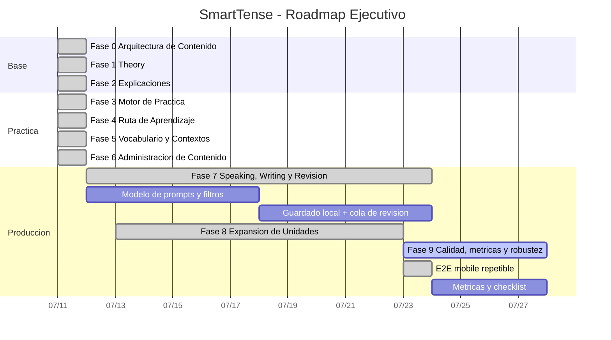

# Plan de Ejecucion por Fases - SmartTense

Este plan convierte el contenido pedagógico de referencia en una implementación incremental y trazable para el software.

Para alinear esta ejecución con la fuente de Dario (Unit 1 - A2), consulta también:

- [Faseo ejecutico detallado desde Dario](./PROJECT_PHASE_EXECUTION_PLAN_FROM_DARIO.md)
- [Plan operativo extendido desde Dario](./SMARTTENSE_PHASE_PLAN_DARIO_INCREMENTAL.md)

## Principios Del Plan

- Cada fase mantiene un alcance cerrado y mensurable.
- Antes de abrir una fase nueva, la fase activa debe cerrar con evidencia.
- La base de datos principal sigue siendo local y file-based (`public/data/verbs.json`, `public/data/learningUnits.json`).
- El roadmap es móvil-first y evita sobrecargar la pantalla en mobile.

## Matriz Ejecutiva y Operativa

### Fase 0 - Arquitectura de Contenido

**Objetivo ejecutivo:** dejar un modelo de contenido confiable y validado.  
**Alcance MVP:** `learningUnits.json` base + validación en tiempo de carga.

**Tareas operativas:**
- Diseñar el esquema de unidad, secciones, ejercicios y contexto.
- Validar contra reglas de shape y límites en `src/data/learningContentValidation.js`.
- Añadir pruebas de integridad para IDs y referencias cruzadas.

**Criterio de cierre:**
- Unidad base cargable desde JSON y con datos inconsistentes rechazados.

Estado: **Cerrada**

### Fase 1 - Teoria y Comprension Guiada

**Objetivo ejecutivo:** explicar la base de presente en una página usable.  
**Alcance MVP:** Objetivos, reglas, errores y ejemplos renderizados desde JSON.

**Tareas operativas:**
- Conectar `Theory` con contenidos en `public/data/learningUnits.json`.
- Mostrar secciones en tarjetas legibles en mobile.
- Añadir soporte bilingual en UI.
- Validar que la lectura no dependa de datos hard-coded.

**Criterio de cierre:**
- Teoria disponible para el estudiante sin editar código.

Estado: **Cerrada**

### Fase 2 - Explicacion de Formas Generadas

**Objetivo ejecutivo:** conectar cada fila con su lógica gramatical.  
**Alcance MVP:** panel `Why this form?` con estructura, patrón y motivo.

**Tareas operativas:**
- Enriquecer metadatos de row generation en `src/conjugation.js`.
- Mantener explicación breve y legible en desktop y mobile.
- Explicar errores típicos (ej. `he doesn't works`).

**Criterio de cierre:**
- Al menos una explicación utilizable para cada forma visible.

Estado: **Cerrada**

### Fase 3 - Motor de Practica Basico

**Objetivo ejecutivo:** permitir practicar y obtener feedback inmediato.  
**Alcance MVP:** completar espacios y transformar oraciones con scoring local.

**Tareas operativas:**
- Cargar ejercicios de `learningUnits`.
- Implementar normalización de respuestas y comparación tolerante.
- Añadir retroalimentación inmediata con progreso por sesión.

**Criterio de cierre:**
- El usuario responde ejercicios y recibe validación local.

Estado: **Cerrada**

### Fase 4 - Camino de Aprendizaje

**Objetivo ejecutivo:** guiar el avance del estudiante por unidad.  
**Alcance MVP:** estados de unidad y recomendación en Home.

**Tareas operativas:**
- Trackear estado de Theory/Practice por unidad.
- Definir reglas de recomendación de siguiente paso.
- Mostrar recomendación clara en Home + opción de reset parcial.

**Criterio de cierre:**
- Home sugiere el siguiente paso relevante sin fricción.

Estado: **Cerrada**

### Fase 5 - Contexto y Vocabulario

**Objetivo ejecutivo:** personalizar ejemplos y ejercicios al contexto del alumno.  
**Alcance MVP:** filtros por contexto y vocabulario contextual en Theory/Practice.

**Tareas operativas:**
- Catalogar contextos en `learningUnits`.
- Mostrar vocabulario y ejemplos filtrados.
- Adaptar ejercicios por contexto.

**Criterio de cierre:**
- El estudiante encuentra ejemplos relevantes de IT, rutina, familia y movimiento.

Estado: **Cerrada**

### Fase 6 - Administracion De Contenido

**Objetivo ejecutivo:** crecer contenido sin editar archivos manualmente.  
**Alcance MVP:** import/export, vista previa, validación y aplicación en Settings.

**Tareas operativas:**
- Validar payload importado antes de aplicar.
- Mostrar resumen de cambios y estructura.
- Exportar estado listo para reemplazo en `public/data/learningUnits.json`.
- Mantener tabla filtrable y paginable para revisión masiva.

**Criterio de cierre:**
- Es posible administrar contenido desde UI local con control y trazabilidad.

Estado: **Cerrada**

### Fase 7 - Speaking, Writing y Revision

**Objetivo ejecutivo:** entrenar producción oral/escrita con seguimiento.  
**Alcance MVP:** queue local de intentos, estados y filtros de revisión.

**Tareas operativas:**
- Definir prompts en `src/data/productionPrompts.js`.
- Guardar intentos localmente con timestamp y estado.
- Mostrar filtros por modo y estado.
- Permitir editar/eliminar con confirmación.

**Criterio de cierre:**
- El usuario abre una tarea, guarda intento y lo revisa en cola.

Estado: **Cerrada**

### Fase 8 - Expansion de Unidades De Tiempo

**Objetivo ejecutivo:** escalar a más unidades sin rediseñar la base.  
**Alcance MVP:** nueva unidad de pasado/futuro/condicional y camino de aprendizaje completo.

**Tareas operativas:**
- Diseñar JSON de unidad con estructura completa.
- Añadir ejercicios de transferencia entre tiempos.
- Mantener rendimiento con paginación, filtros y ordenado de filas.
- Probar UX en mobile por encima de desktop.

**Criterio de cierre:**
- Mínimo una unidad adicional completa validada por ejecución y tests. Cumplido con `npm test`, `npm run build`, smoke mobile CDP y QA alto volumen de 500 verbos.

Estado: **Cerrada**

### Fase 9 - Calidad, Metricas Y Robustez

**Objetivo ejecutivo:** hacer repetible la validacion de pantallas criticas y registrar evidencia medible para release interna.
**Alcance MVP:** smoke E2E mobile local, metricas basicas y checklist de pantallas.

**Tareas operativas:**
- Mantener `npm run test:e2e:mobile` como recorrido mobile de referencia.
- Validar Home, Theory, Practice, Individual, Complete, Production y Settings.
- Usar 500 verbos sinteticos para cubrir alto volumen sin tocar la data fuente.
- Definir metricas de experiencia y umbrales internos.
- Preparar checklist de release interna.

**Criterio de cierre:**
- `npm test`, `npm run build` y `npm run test:e2e:mobile` verdes con evidencia registrada.

Estado: **En curso**. F9a entregada con el script `scripts/mobile-smoke.cjs`.

## Plan Gantt Interno

## Hoja de Ruta de Ejecutable Inmediato

1. Definir metricas de experiencia y umbrales internos.
2. Revisar accesibilidad y textos de pantallas criticas.
3. Preparar checklist de release interna por pantalla.
4. Evaluar optimizacion adicional solo si el volumen supera el limite actual de 500 verbos.
