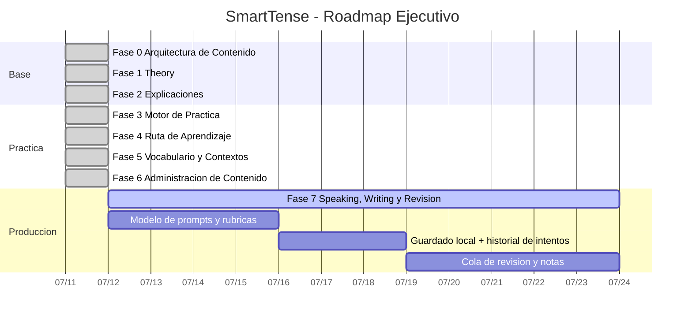

# Plan de Ejecucion por Fases - SmartTense

Este plan convierte el contenido pedagógico revisado en un cronograma incremental y trazable.  
La meta es mantener la app simple, operativa en web y mobile, y con mejoras visibles por fase.

## Principios Del Plan

- Cada fase tiene alcance cerrado, sin mezclar refactor cosmético.
- Se documenta por separado:
  - Objetivo ejecutivo.
  - Tareas operativas de desarrollo.
  - Criterio de salida.
- Antes de abrir una fase nueva, la fase activa debe cerrar con evidencia y validacion basica.
- La estructura de datos sigue siendo la base de todo; no hay backend en este roadmap.

## Matriz Ejecutiva y Operativa

### Fase 0 - Arquitectura de Contenido

Objetivo ejecutivo: dejar un modelo de contenido confiable y validado.
Entregable: `public/data/learningUnits.json` con unidad base y validacion estricta.
Tareas operativas:
- Diseñar esquema para learning content y contexto.
- Validar con `src/data/learningContentValidation.js`.
- Asegurar fallback para cargas fallidas.
Criterio de salida:
- Unidad base cargable desde JSON sin datos invalidos.
- Pruebas de validacion verdes.

### Fase 1 - Teoria y Comprension Guiada

Objetivo ejecutivo: explicar teoria de Present Simple desde una sola pagina funcional.
Entregable: pagina `Theory` con objetivos, reglas, errores y ejemplos.
Tareas operativas:
- Renderizar contenidos desde JSON.
- Mostrar estructuras, palabras clave, errores comunes y ejercicios iniciales.
- Control bilingue EN/ES.
Criterio de salida:
- Teoria disponible sin hardcodeo.
- UI responsive y lectura clara en movil.

### Fase 2 - Explicacion de Formas Generadas

Objetivo ejecutivo: conectar tabla con razon gramatical.
Entregable: panel `Why this form?` reutilizable.
Tareas operativas:
- Adjuntar metadata explicativa a filas de conjugacion.
- Render panel en Home/Individual/Complete.
Criterio de salida:
- Al menos una explicacion visible por forma.
- Prueba o inspeccion funcional en flujo principal.

### Fase 3 - Motor de Practica Basico

Objetivo ejecutivo: convertir observacion en practica activa.
Entregable: ejercicios con respuesta, normalizacion y feedback local.
Tareas operativas:
- Tipos: completar, transformar y escoger tiempo.
- Agregar filtro por contexto.
- Guardar resultados por sesion local.
Criterio de salida:
- Usuario puede completar ejercicios y ver retroalimentacion inmediata.

### Fase 4 - Camino de Aprendizaje

Objetivo ejecutivo: dar continuidad desde teoria hasta practica.
Entregable: progreso local y recomendacion de siguiente paso.
Tareas operativas:
- Estados de unidad (pendiente, en progreso, completada).
- Recomendador en Home.
- Reset y reset por unidad.
Criterio de salida:
- Home responde con siguiente actividad sugerida.

### Fase 5 - Contexto y Vocabulario

Objetivo ejecutivo: hacer los ejemplos mas reales para el perfil de estudiante.
Entregable: filtros por contexto y vocabulario contextual.
Tareas operativas:
- Cargar tags de contexto en contenido.
- Mostrar vocabulario contextual en Theory y Practice.
- Filtrar ejercicios por contexto seleccionado.
Criterio de salida:
- Casos de uso IT, rutina, familia, viajes y preposiciones disponibles.

### Fase 6 - Administracion de Contenido

Objetivo ejecutivo: permitir administrar contenido sin editar archivos manuales.
Entregable: editor base en Settings para import/export y vista previa.
Tareas operativas:
- Importar JSON de content.
- Validar antes de aplicar.
- Exportar payload listo para reemplazo en `public/data/learningUnits.json`.
- Mostrar resumen de unidades, contextos y ejercicios.
Criterio de salida:
- Cambio de contenido posible por UI sin tocar codigo.

### Fase 7 - Speaking, Writing y Revision

Objetivo ejecutivo: introducir produccion oral y escrita como practica de fluidez.
Entregable: tareas de speaking/writing por unidad y cola de revision.
Tareas operativas:
- Diseñar modelo de prompts (tipo speaking/writing) con rubricas.
- Implementar timer, area de respuesta y guardado local por intento.
- Agregar notas de autoevaluacion, estado de revision, y seguimiento por unidad.
- Crear cola de revision de errores frecuentes.
Criterio de salida:
- Se puede abrir tarea de speaking o writing, guardar intento y verlo en cola de revision.

## Plan Gantt Interno

## Hoja de Ruta de Ejecutable Inmediato

1. Definir primer set de prompts de Speaking y Writing para Present Simple.
2. Implementar el flujo de guardado local de intentos.
3. Agregar estado `needsReview` y filtro por estado en cola.
4. Añadir pagina o seccion de revision para practicas recurrentes.
5. Medir uso y ajustar layout mobile antes de ampliar a mas unidades.

