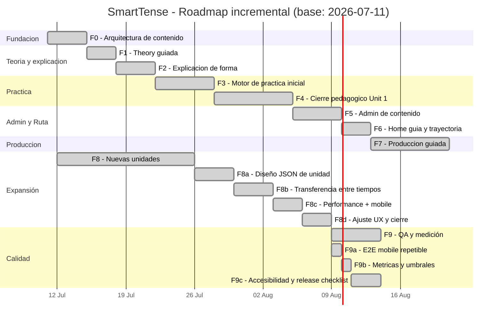

# Roadmap de Desarrollo Incremental - SmartTense

## Base y criterio

Este plan usa el documento pedagógico `DARIO _ GENERAL ENGLISH COURSE.docx` (Unit 1 - Verb tenses and daily habits) como insumo de contenido y lo transforma en un cronograma de ejecución de producto.

- **Fecha base interna:** 11/07/2026
- **Enfoque:** por fases cerrables, incremental, sin rediseñar el núcleo existente.
- **Modo de control:** ejecutar una fase completamente (MVP + checks) antes de abrir la siguiente.

Lo que aporta el documento pedagógico al proyecto:

- Objetivos de aprendizaje medibles por unidad.
- Estructura `definición -> regla -> práctica -> errores -> tarea`.
- Ejercicios de tres formatos iniciales: fill-in-the-blank, transformación y traducción ES->EN, más práctica oral.
- Foco en repetición escalonada: rutina, uso guiado y consolidación.
- Errores frecuentes de hispanohablantes para incluir retroalimentación útil.

## Fases ejecutivas y tareas operativas

### Fase 0 — Arquitectura de contenido (Cerrada)
**Objetivo ejecutivo:** tener una base de contenido confiable, validable y escalable.

**Tareas operativas:**
- Normalizar `public/data/learningUnits.json` con unidades, secciones, objetivos, estructuras, vocabulario, contextos y ejercicios.
- Implementar validación de schema en `src/data/learningContentValidation.js`.
- Añadir pruebas automáticas para forma de ids, referencias y límites de texto.

**Criterio de salida:**
- App solo renderiza contenido válido, y no rompe frente a entradas inválidas.

### Fase 1 — Theory guiada (Cerrada)
**Objetivo ejecutivo:** permitir al estudiante aprender la base antes de practicar.

**Tareas operativas:**
- Conectar `Theory` a la nueva unidad base y renderizar contenido desde JSON.
- Agregar objetivos, reglas, ejemplos de uso y errores típicos.
- Añadir texto bilingüe (EN/ES) para notas de apoyo.
- Ajustar layout mobile para lectura rápida y limpia.

**Criterio de salida:**
- El estudiante puede estudiar una unidad con contenido completo sin tocar código.

### Fase 2 — Explicación de forma (Cerrada)
**Objetivo ejecutivo:** explicar por qué aparece cada forma, no solo mostrarla.

**Tareas operativas:**
- Expandir metadatos de filas para sujeto, auxiliar, verbo y motivo de uso.
- Mostrar panel `Why this form?` en `Complete`, `Individual` y tarjeta móvil.
- Crear ejemplos de contraste con errores típicos (ej. `he don't`).

**Criterio de salida:**
- Cada forma visible permite consultar estructura + explicación entendible.

### Fase 3 — Motor de práctica inicial (Cerrada)
**Objetivo ejecutivo:** convertir teoría en producción inmediata con feedback.

**Tareas operativas:**
- Implementar generador de ejercicios por unidad/contexto desde `learningUnits.json`.
- Soportar corrección tolerante y feedback instantáneo.
- Guardar estado de avance local por sesión.

**Criterio de salida:**
- Al menos tres tipos de ejercicio generan retroalimentación utilizable.

### Fase 4 — Cierre pedagógico de Unit 1 (Cerrada)
**Objetivo ejecutivo:** completar la unidad inicial de entrada como experiencia end-to-end.

**Tareas operativas:**
- Completar contenidos pendientes del presente (`present simple`, `present continuous`, `present perfect`, `present perfect continuous`) con ejemplos y errores.
- Ordenar progresión: objetivo → regla → práctica → consolidación.
- Incluir vocabulario y preposiciones básicas de rutina diaria.
- Ajustar dificultad y consistencia de feedback de ejercicios.

**Criterio de salida:**
- Unit 1 cubierta de manera integral en Theory + Practice + Producción guiada.

### Fase 5 — Administración de contenido (Cerrada)
**Objetivo ejecutivo:** editar/gobernar contenido sin editar JSON manualmente.

**Tareas operativas:**
- Completar la sección de Settings para importar/exportar contenido de aprendizaje.
- Vista de preview y validación antes de aplicar cambios a sesión.
- Confirmación explícita en acciones destructivas.
- Tabla ordenable/filtrable para revisión masiva + paginación.

**Criterio de salida:**
- Un editor puede revisar y publicar cambios de contenido de forma controlada.

### Fase 6 — Home como guía de trayectoria (Cerrada)
**Objetivo ejecutivo:** minimizar fricción para avanzar.

**Tareas operativas:**
- Definir estado por unidad (`not started`, `in progress`, `completed`).
- Recomendación contextual de siguiente paso en Home.
- Recomendación por unidad y botón de continuación rápida.
- Resumen de progreso visible por bloque.

**Criterio de salida:**
- El usuario siempre llega a una siguiente acción clara con mínimo ruido visual.

### Fase 7 — Producción guiada (Cerrada)
**Objetivo ejecutivo:** entrenar speaking y writing con seguimiento de estado.

**Tareas operativas:**
- Mantener prompts con `src/data/productionPrompts.js`.
- Cola local de intentos: `draft`, `done`, `needsReview`, `approved`.
- Edición/cancelación con confirmaciones.
- Filtros por modo, estado y búsqueda; import/export opcional para prompts/attempts.

**Criterio de salida:**
- El estudiante completa un intento, lo guarda, lo revisa y avanza estado.

### Fase 8 — Expansión de unidades y gramática (Cerrada)
**Objetivo ejecutivo:** pasar de unidad inicial a multiunidad sin duplicar arquitectura.

**Tareas operativas:**
- Diseñar unidad de `past`, `future`, `conditional` con estructura completa.
- Reusar motor de conjugación existente y adaptar reglas/errores del Dario.
- Añadir ejercicios de transferencia entre tiempos (comparar formas similares).
- Mejorar mobile primero, filtros y ordenamiento con rendimiento estable.

**Criterio de salida:**
- Al menos un bloque adicional completo de teoría + práctica + producción, sin regresiones. Cumplido con `npm test`, `npm run build`, smoke mobile CDP y QA alto volumen de 500 verbos.

### Fase 9 — Calidad, métricas y robustez (Cerrada)
**Objetivo ejecutivo:** elevar estabilidad para volumen y uso real.

**Tareas operativas:**
- Tests E2E básicos de pantallas críticas (Home, Theory, Individual, Complete, Production, Settings).
- Definir KPIs de experiencia: tiempo a primera acción y tasa de completion de ejercicios.
- Optimizar render en listas grandes (virtualización si fuera necesario).
- Revisión de accesibilidad y textos claros para mobile.

**Criterio de salida:**
- Flujo estable con regresiones controladas y evidencia medible en pruebas.

**Estado actual:**
- F9a entregada con `npm run test:e2e:mobile`, que valida Home, Theory, Practice, Individual, Complete, Production y Settings en viewport mobile `390x844` con 500 verbos sinteticos.
- F9b entregada con quality gates internos: Home <= `5000ms`, Settings <= `2000ms`, viewport `390x844`, 500 verbos sinteticos y 25 filas visibles en Settings.
- F9c entregada con verificaciones de accesibilidad basica en el smoke mobile y `docs/RELEASE_CHECKLIST.md`.
- F9d cerrada sin virtualizacion: el limite actual es 500 verbos y el smoke valida ese maximo con paginacion estable.

## Dependencias técnicas transversales

- `src/App.jsx`: orquestación de páginas y estado global.
- `src/conjugation.js`: formato de fila y explicación pedagógica.
- `src/data/learningContentValidation.js` y `src/data/validation.js`: calidad de payload.
- `src/data/productionPrompts.js`: prompts iniciales para Production.
- `public/data/learningUnits.json`: contenido de unidad principal.

## Gantt interno (Mermaid)

## Cierre de fase y validación continua

Cada fase termina con:
- Cambios funcionales visibles.
- `npm test` y `npm run build` sin regresiones.
- Evidencia manual en navegador (flujo completo de esa fase).
- Documentación actualizada de usuario y desarrollador.

## Ruta de trabajo recomendada (próximo tramo)

1. Definir la siguiente fase de producto antes de abrir trabajo nuevo fuera del MVP actual.

