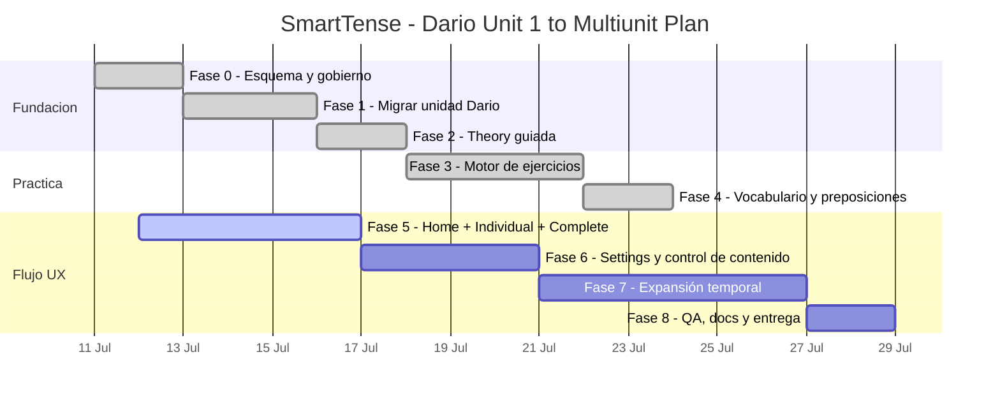

# Fases de Desarrollo Basadas en DARIO_UNIT1

Documento fuente:
`DARIO _ GENERAL ENGLISH COURSE.docx`

Fecha base:
11/07/2026

Resumen ejecutivo:
Este roadmap convierte la unidad `VERB TENSES AND DAILY HABITS` del documento de Dario en tareas de producto para SmartTense.
La idea es mantener todo incremental, con fases cerrables, y evitar trabajo no validado o cambios estructurales de alto impacto.

## 1) Alcance detectado en el documento

- Objetivo general del alumno:
  - dominar present simple/continuous/perfect/perfect continuous en contextos reales.
- Bloques de aprendizaje claros:
  - objetivos;
  - definicion y usos por tiempo;
  - estructuras por forma (afirmativa, negativa, interrogativa, interrogativa negativa);
  - errores comunes de hispanohablantes;
  - ejemplos contextualizados (IT, rutina diaria, familia, transporte, preposiciones);
  - ejercicios por tipo y dificultad;
  - practica de speaking/writing.
- Tipos de ejercicio incluidos en el documento:
  - rellenar espacios;
  - transformar;
  - elegir tiempo correcto;
  - corregir error;
  - traduccion ES->EN;
  - tareas de speaking/writing;
  - consolidacion entre tiempos.

Este material recomienda mantener el motor de conjugacion actual (base tecnica) y mejorar:
1) la experiencia guiada,
2) la calidad pedagógica de la practica,
3) la administración del contenido en Settings.

## 2) Plan Ejecutivo + Tareas Operativas

Para cada fase se incluye:
- objetivo ejecutivo;
- tareas operativas concretas;
- criterio de salida para cerrar la fase.

### Fase 0 - Gobierno de contenidos y esquema base

**Objetivo ejecutico:** estabilizar el contrato de datos de curso y evitar errores en runtime.

**Tareas operativas**
- Definir un esquema interno de unidad con campos `learningUnits`:
  - metadata de unidad,
  - objetivos,
  - bloques gramaticales por tiempo,
  - estructuras por forma,
  - errores comunes,
  - examples,
  - vocabulario,
  - ejercicios por tipo.
- Definir reglas de validacion para ids, referencias, longitudes y tipos.
- Normalizar catalogo de contextos y validar que los IDs existan.
- Actualizar pruebas de integridad y mensajes de error.

**Criterio de salida**
- Un archivo de unidad invalida no rompe la app.
- Mensajes de rechazo claros y trazables.

### Fase 1 - Migracion de contenidos de Dario a unidad estructurada

**Objetivo ejecutico:** convertir Unit 1 en contenido reutilizable, versionado y verificable.

**Tareas operativas**
- Crear `learningUnits.json` con:
  - objetivos de la unidad;
- bloques gramaticales de `PRESENT SIMPLE`, `PRESENT CONTINUOUS`, `PRESENT PERFECT SIMPLE`, `PRESENT PERFECT CONTINUOUS`;
- secciones de reglas:
  - usos,
  - palabras clave,
  - formas gramaticales.
- mapear ejemplos del documento por tiempo + contexto.
- mapear errores frecuentes:
  - `he work` -> `he works`,
  - forms with auxiliary,
  - uso de `ing`, `ed`, `ing` + verb spellings.

**Criterio de salida**
- Unit 1 visible en JSON sin depender de texto hardcodeado.

### Fase 2 - Theory guiada y experiencia de estudio

**Objetivo ejecutico:** permitir que el alumno entienda la regla antes de practicar.

**Tareas operativas**
- Renderizar secciones de Theory desde JSON:
  - objetivos,
  - significado de tiempo,
  - estructuras,
  - errores,
  - ejemplos,
  - apoyo por contexto.
- Agregar controles de contexto y progresion visual (mobile-first).
- Añadir textos de apoyo para aprendiz español/frances.
- Mantener la vista compacta para pantallas chicas.

**Criterio de salida**
- Un usuario puede estudiar Unit 1 sin abrir ninguna pantalla de edición.

### Fase 3 - Practica formativa (starter) basada en la unidad

**Objetivo ejecutico:** transformar la teoria en practica corta con feedback inmediato.

**Tareas operativas**
- Implementar tipos de ejercicio del documento:
  - fill in;
  - transform;
  - choose tense;
  - correct mistake;
  - translation.
- Añadir normalizacion de respuestas (caso, espacios, contracciones comunes).
- Mostrar retroalimentacion local inmediata.
- Guardar estado de intento por unidad.
- Agregar consolidacion cruzada de tiempos como ejercicio de cierre de unidad.

**Criterio de salida**
- 3 tipos de ejercicio funcionan end-to-end y reportan feedback correcto.

### Fase 4 - Consolidacion pedagógica y soporte (vocabulario + preposiciones)

**Objetivo ejecutico:** mejorar la transferencia real sin ruido visual.

**Tareas operativas**
- Incluir seccion de `Vocabulario`.
- Incluir ejercicios de preposiciones:
  - tiempo/lugar (`at`, `in`, `on`);
  - direccion (`to`, `into`, `from`, `through`, etc).
- Mapear ejercicios de apoyo por contexto para que Theory/Practice compartan filtro de contexto.
- Ajustar orden y jerarquia visual de bloques para reducir scroll.

**Criterio de salida**
- El contexto afecta Theory y Practice de forma consistente.

### Fase 5 - UX de ejecucion diaria (Home, Individual, Complete, mobile)

**Objetivo ejecutico:** reducir la friccion en uso diario y en celular.

**Tareas operativas**
- Home:
  - resumen de progreso por unidad,
  - sugerencia de siguiente accion,
- Individual:
  - control multi-select de tiempos y sujetos,
  - tarjetas compactas por selector de grupo.
- Complete:
  - filtros claros,
  - orden y paginacion para listas grandes,
  - estados de columnas persistentes.
- Verificar experiencia mobile en 390px, con densidad baja y no sobrecarga de scroll.

**Criterio de salida**
- Flujo Home -> Unit -> Theory -> Practice -> repaso usable en <3 scrolls promedio.

### Fase 6 - Gestion de curso (Settings) con import/export y edición controlada

**Objetivo ejecutico:** permitir administracion de verbos y aprendizaje sin tocar codigo.

**Tareas operativas**
- En Settings, agregar:
  - import/export de base de verbos;
  - import/export de unidades de aprendizaje;
  - preview de cambios y validacion pre-apply.
- Habilitar tabla indexada, filtrable y ordenable para revision.
- Opcion de edicion:
  - modo readonly por defecto;
  - bulk edit opcional cuando el usuario quiera cambios masivos;
  - confirmaciones explicitas para guardar, editar y eliminar.
- Añadir "cancel" de edición por fila.
- Registrar historial de cambios en logs de ejecución de fase.

**Criterio de salida**
- Cambios masivos y puntuales se hacen desde UI local sin riesgo.

### Fase 7 - Expansión de unidad y ejercicios de transferencia

**Objetivo ejecutico:** ampliar a past/future/conditional sin rediseñar el core.

**Tareas operativas**
- Diseñar nuevas unidades de past/future/conditional con la misma plantilla.
- Reusar motor de conjugacion y capas de filtro/orden/paginacion.
- Añadir ejercicios de comparacion:
  - presente vs pasado,
  - presente simple vs continuo,
  - perfecto vs perfecto continuo.
- Mantener rutas de progreso por unidad.

**Criterio de salida**
- Al menos un bloque temporal adicional completo (teoria + practica + support) funcionando.

### Fase 8 - Cierre de calidad (QA + docs + release)

**Objetivo ejecutico:** cerrar con estabilidad y traza de evidencia.

**Tareas operativas**
- Ejecutar:
  - `npm test`
  - `npm run build`
  - validacion manual de pantallas críticas (Home, Theory, Practice, Individual, Complete, Production, Settings)
- Revisar mobile con filtros y paginacion.
- Actualizar log y documentos del proyecto:
  - developer,
  - usuario final,
  - github/pages,
  - phase plan.

**Criterio de salida**
- Sin regresiones funcionales y evidencia de cada fase registrada.

## 3) Gantt interno recomendado

## 4) Orden operativo sugerido (tramo inicial)

1. Completar Fase 3 y Fase 4 con el set actual de Unit 1.
2. Fase 5 con foco mobile y densidad visual.
3. Fase 6 (tabla filtrable, bulk edit opcional, confirmaciones y cancel).
4. Fase 7 para ampliar past/future/conditional.
5. Cierre Fase 8 y push a main con evidencia de ejecución.

## 5) Riesgos y seguimiento

- Riesgo principal: densidad de UI en mobile al crecer filtros y volumen.
  - Mitigacion: paginacion y vista compacta por defecto.
- Riesgo secundario: cambios de schema sin pruebas.
  - Mitigacion: validacion + tests + cierre por fase.
- Riesgo de UX: exceso de clics al activar muchos filtros.
  - Mitigacion: atajos `todos/ninguno` por grupo y presets por contexto.
