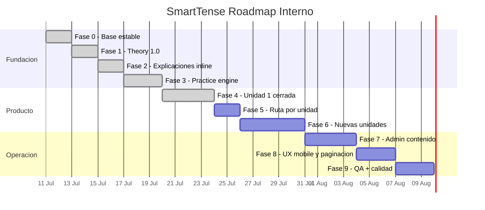

# Roadmap Ejecutivo — SmartTense (Faseo por producto)

**Fuente:** `DARIO _ GENERAL ENGLISH COURSE.docx`  
**Unidad base analizada:** `A2 ENGLISH LEVEL — UNIT 1: Verbs tenses and daily habits`  
**Fecha base:** 11/07/2026  
**Objetivo del plan:** convertir contenido pedagógico en un producto incremental, escalable y mantenible.

## Qué aporta esta referencia al producto

El curso de Dario entrega una estructura completa para evolución pedagógica:

- Objetivos de aprendizaje explícitos por unidad.
- Secuencia sugerida: objetivos -> reglas -> práctica -> consolidación.
- Uso de formatos de práctica variados: completar, transformar, traducir, corregir errores, y speaking/writing.
- Detección de errores típicos de hispanohablantes (ej. `he work`, *subject-verb agreement*).
- Contextos reales: IT, rutina diaria, familia, viajes, reuniones.
- Vocabulario temático y refuerzo de preposiciones.

SmartTense puede mapear esto con su stack actual (Theory + Practice + Individual + Complete + Production + Settings).

---

## Fases ejecutivas y tareas operativas

### Fase 0 — Base de contenido estable

**Objetivo ejecutivo:** disponer de un modelo de contenido seguro y escalable para toda la app.

**Tareas operativas**
- Definir/normalizar `public/data/learningUnits.json` con: unidades, secciones, secciones de gramática, ejercicios, vocabulario y contexto.
- Fortalecer `src/data/learningContentValidation.js` (IDs, referencias, tamaños, esquema de versión, campos permitidos).
- Documentar shape validado en `docs/LEARNING_CONTENT_SCHEMA.md`.
- Añadir pruebas de integridad y regresión de carga/parseo.

**Entregable**
- El contenido inválido no entra a runtime.

---

### Fase 1 — Theory 1:0 (unidad guiada mínima)

**Objetivo ejecutivo:** ofrecer un módulo de estudio con estructura pedagógica completa para la Unidad 1.

**Tareas operativas**
- Convertir las secciones de la unidad a data-driven:
  - objetivos de aprendizaje
  - significados y usos
  - palabras clave
  - formas gramaticales
  - errores comunes
  - ejemplos y práctica de muestra
  - vocabulario contextual
- Revisar flujo de contexto (IT, rutinas, familia, reuniones).
- Añadir soporte EN/ES para notas pedagógicas.

**Entregable**
- Theory usable como pantalla de estudio completa sin editar código.

---

### Fase 2 — Explicaciones en línea por forma

**Objetivo ejecutivo:** explicar el mecanismo interno de cada frase para reducir memorización mecánica.

**Tareas operativas**
- Enriquecer metadata de la fila en `src/conjugation.js` para explicación rápida (`subject`, `auxiliary`, `verbForm`, `reason`).
- Mostrar `Why this form?` en Complete e Individual.
- Añadir ejemplos de error frecuente y corrección guiada.

**Entregable**
- Cada fila visible puede explicarse con 1 interacción.

---

### Fase 3 — Practice Engine inicial

**Objetivo ejecutivo:** que el alumno practique y reciba feedback inmediato.

**Tareas operativas**
- Definir tipos de ejercicio en JSON:
  - fill-in-the-blank
  - transform
  - select tense
  - error correction
  - translation ES->EN
  - task speaker/writer
- Implementar normalización de respuestas y scoring local.
- Persistir estado de draft por unidad.
- Filtros por contexto y tipo de ejercicio.

**Entregable**
- Práctica inicial con feedback local y trazabilidad de avance por unidad.

---

### Fase 4 — Unidad 1 completa y consolidada

**Objetivo ejecutivo:** cerrar la unidad inicial del curso como referencia de calidad.

**Tareas operativas**
- Completar y unificar Present Simple / Present Continuous / Present Perfect / Present Perfect Continuous.
- Añadir práctica de preposiciones (tiempo/lugar/dirección) alineada a los ejemplos.
- Añadir ejercicio final tipo *Typical Day* como puente a producción libre.
- Homogeneizar nivel de dificultad, longitud de instrucciones y estilo de feedback.

**Entregable**
- Unidad 1 end-to-end (Theory + Practice + Production corta) con progresión coherente.

---

### Fase 5 — Ruta de aprendizaje y experiencia de progreso

**Objetivo ejecutivo:** guiar al alumno con una ruta clara entre módulos.

**Tareas operativas**
- Selección y persistencia de unidad activa en Home/Settings.
- Estados por bloque (Theory, Practice, Production) por unidad.
- Recomendación contextual de "siguiente paso" en Home.
- Reset de unidad sin perder el resto de la sesión.

**Entregable**
- Home funciona como dashboard de progreso y navegación no ambigua.

---

### Fase 6 — Expansión de unidades

**Objetivo ejecutivo:** escalar de Unidad 1 a bloques de tiempo adicionales.

**Tareas operativas**
- Diseñar `past/future/conditional` con la misma estructura data-driven.
- Crear ejercicios de contraste entre tiempos (ej. diferencia entre perfecto y continuo).
- Reutilizar componentes existentes para no duplicar render o estado.
- Ajustar filtros de tensos por level/estado para móvil y desktop.

**Entregable**
- Al menos una nueva unidad funcional integrada con su progreso.

---

### Fase 7 — Administración segura de contenido

**Objetivo ejecutivo:** permitir mantenimiento de contenidos sin editar archivos manualmente.

**Tareas operativas**
- Incluir administración en Settings:
  - import / export de `learningUnits`
  - vista previa de cambios
  - validación obligatoria antes de aplicar
  - confirmación explícita de acción.
- Filtros, orden y paginación de tabla de revisión.
- Modo Bulk Edit opcional para ajustes masivos.

**Entregable**
- Flujo de edición y despliegue de contenido preparado para el reuso por desarrollador.

---

### Fase 8 — UX mobile + volumen

**Objetivo ejecutivo:** sostener usabilidad con más contenido y más filas.

**Tareas operativas**
- Compactar tarjetas y controles para flujos repetitivos.
- Revisar jerarquía visual en Home/Individual/Complete/Settings.
- Implementar paginación y límites de render para listas largas.
- Revisar legibilidad y áreas táctiles en móvil.

**Entregable**
- Menor fatiga visual y menor scroll para usuarios frecuentes.

---

### Fase 9 — Calidad, QA y evidencias

**Objetivo ejecutivo:** estabilizar releases incrementales.

**Tareas operativas**
- Definir suite de tests por flujo crítico (Home, Theory, Practice, Individual, Complete, Production, Settings).
- Añadir pruebas de validación de progreso y esquema para cambios nuevos.
- Definir métricas de producto:
  - tiempo a primera acción
  - tasa de completar unidad
  - recurrencia de ejercicios.

**Entregable**
- Fases cerradas con evidencia (`npm test`, `npm run build`, revisión manual del flujo).

---

## Gantt interno (Mermaid)

## Relación operativa recomendada

- **Sprint 1 (5 días):** Fase 4 (cierre pedagógico) + ajustes de feedback de unidad.
- **Sprint 2 (4 días):** Fase 6 (unidad 2) + pruebas de contraste entre tiempos.
- **Sprint 3 (3 días):** Fase 8 (UX mobile y tabla/paginación) + validación visual.
- **Sprint 4 (3 días):** Fase 9 + documentación de evidencia de cierre.

## Dependencias técnicas

- `public/data/learningUnits.json`
- `src/data/learningContentValidation.js`
- `src/learningContexts.js`
- `src/practice.js`
- `src/learningPath.js`
- `src/App.jsx`
- `src/data/productionPrompts.js`
- `docs/LEARNING_CONTENT_SCHEMA.md`
