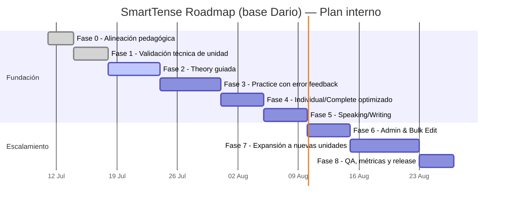

# Roadmap Ejecutivo por Fases — SmartTense (Fuente: DARIO)

**Fuente pedagógica base:** `DARIO _ GENERAL ENGLISH COURSE.docx` (nivel A2, Unit 1: _Verb tenses and daily habits_).  
**Fecha de alineación:** 11/07/2026.

## 1) Resumen ejecutivo del curso y propuesta de producto

El documento de Dario aporta una ruta sólida para el siguiente nivel:

- aprender reglas por uso, no solo formas;
- practicar:
  - afirmativo / negativo / interrogativo / interrogativo negativo;
  - errores típicos de hispanohablantes;
  - ejercicios de selección, transformación, corrección y traducción;
  - speaking y writing con tareas guiadas;
- reforzar con contexto (IT, rutina diaria, familia, preposiciones) y vocabulario;
- avanzar hacia dominio práctico de los tiempos.

En SmartTense el objetivo es convertir esa estructura pedagógica en una **experiencia guiada incremental**, usando:

- `learningUnits.json` como fuente única de teoría, ejemplos y ejercicios;
- `Theory` como lectura breve y accionable;
- `Practice` como práctica con feedback inmediato;
- `Individual` y `Complete` como práctica de aplicación;
- `Production` como salida oral/escrita;
- `Settings` como administración profesional de datos (import/export, validación, edición guiada y bulk edit opcional).

---

## 2) Fases Ejecutivas (macro)

### Fase 0 — Alineación pedagógica y del producto

**Objetivo ejecutivo:** convertir el curso en una base de conocimiento ejecutable y trazable para desarrollo incremental.

#### Tareas operativas

- Catalogar el contenido clave del documento en:
  - objetivos;
  - teoría por tiempo;
  - estructuras por forma;
  - señales de uso;
  - errores tipicos;
  - ejemplos;
  - ejercicios (completar, transformar, elegir tiempo, corrección, traducción);
  - speaking/writing prompts.
- Definir versión de contenido y convenciones de naming.
- Verificar que `learningUnits.json` y el validador soporten el shape completo.

#### Entregables de fase

- Esquema de aprendizaje validado.
- Riesgos pedagógicos detectados y priorizados.
- Criterios de calidad para ejercicios y explicaciones.

---

### Fase 1 — Base técnica para unidades de aprendizaje (sin cambios de UI)

**Objetivo ejecutivo:** asegurar estabilidad del pipeline de contenido y reducir deuda técnica antes de crecer UI.

#### Tareas operativas

- Mantener `public/data/learningUnits.json` como fuente única de teoría y ejercicios.
- Cerrar validadores de contenido (`src/data/learningContentValidation.js`) para:
  - secciones nuevas;
  - nuevos tipos de ejercicios;
  - referencias de contexto consistentes.
- Añadir cobertura de tests para shape, IDs y referencias cruzadas.
- Actualizar `docs/LEARNING_CONTENT_SCHEMA.md`.

#### Entregables de fase

- Carga robusta de unidad y rechazo explícito de contenido inválido.
- `npm test` y `npm run build` verdes con validación activa.

---

### Fase 2 — Módulo de Teoría y comprensión guiada

**Objetivo ejecutivo:** que el usuario comprenda cada tiempo desde la práctica, no por memorizar formas.

#### Tareas operativas

- Enlazar en `Theory` las siguientes secciones del documento:
  - definición y uso;
  - estructura por forma;
  - palabras clave (always, usually, this week, since…);
  - reglas de spelling y notas de forma;
  - errores comunes;
  - ejemplos contextualizados (IT y rutina diaria).
- Crear tarjetas compactas y filtrables por contexto.
- Guardar una lectura por tiempo con progresión mínima:
  - Present Simple,
  - Present Continuous,
  - Present Perfect,
  - Present Perfect Continuous.

#### Entregables de fase

- Teoría inicial completamente guiada desde JSON.
- Lecciones legibles en móvil con scroll natural y baja carga visual.

---

### Fase 3 — Práctica escalonada e interpretación de errores

**Objetivo ejecutivo:** convertir teoría en evidencia de dominio.

#### Tareas operativas

- Incluir en `Practice` tipos de ejercicio derivados del documento:
  - fill in the blank;
  - transformar frase;
  - escoger tiempo correcto;
  - corregir oración con error;
  - traducción ES→EN (A2).
- Soportar puntuación local y feedback textual breve.
- Añadir ejercicios de comparación de tiempos para evitar confusión entre tenses.

#### Entregables de fase

- Práctica con retroalimentación accionable.
- Registro local de progreso de unidad por tipo de avance (viewed/started/completed).

---

### Fase 4 — Aplicación y transferencia (Conjugación enfocada)

**Objetivo ejecutivo:** transformar práctica repetitiva en uso deliberado.

#### Tareas operativas

- Afinar `Individual` para rutas de práctica corta:
  - controles por grupos de tiempo (Pasado/Presente/Futuro/Conditional con Simple/Perfect/Continuous);
  - controles por sujeto;
  - explicabilidad breve de forma (`Why this form?`).
- Mantener `Complete` como vista de contraste total (Afirm./Neg./Interr./Neg.Interr.).
- Añadir reglas de UX para reducir fatiga visual en desktop y móvil.

#### Entregables de fase

- Flujos de práctica más cortos y menos densos visualmente.
- Transición consistente: `Individual` → `Complete` sin cambiar dominio funcional.

---

### Fase 5 — Contenido oral y escritura

**Objetivo ejecutivo:** convertir la plataforma en preparación práctica real (no solo análisis de formas).

#### Tareas operativas

- Formalizar prompts de Speaking/Writing por unidad y tiempo.
- Habilitar autoevaluación y estado de intento.
- Exigir progreso antes de pasar a unidades nuevas (regla configurable).
- Añadir rúbricas breves por tarea (claridad, gramática, fluidez).

#### Entregables de fase

- Tareas de producción reutilizables y rastreables por unidad.
- Evidencia de práctica y revisión local.

---

### Fase 6 — Administración y mantenimiento a escala

**Objetivo ejecutivo:** escalar contenido sin depender de cambios manuales frágiles.

#### Tareas operativas

- Robustecer `Settings` de aprendizaje:
  - import/export de JSON de contenido;
  - vista previa y validación previa a aplicar;
  - edición de fila + cancelación;
  - **Bulk Edit opcional** (tabla completa de verbos y contenido),
  - paginación + orden + búsqueda.
- Añadir confirmaciones explícitas para editar / eliminar / guardar lote.

#### Entregables de fase

- Flujo de administración estable para actualizar contenido desde UI.
- Trazabilidad de cambios y export para PR.

---

### Fase 7 — Expansión controlada de unidades y unidad multiunidad

**Objetivo ejecutivo:** incorporar nuevos bloques del curso de forma escalable.

#### Tareas operativas

- Crear siguiente unidad con:
  - pasado, futuro y condicional (Simple/Perfect/Continuous),
  - ejercicios de transferencia entre tiempos (presente ↔ pasado/futuro/condicional),
  - ejercicios con contexto IT + vida diaria.
- Ajustar navegación por unidad en Home + progreso por unidad.
- Mantener rendimiento con paginación, filtros y ordenamiento.

#### Entregables de fase

- Al menos una unidad adicional completamente funcional.
- Aprendizaje persistente y navegación multiunidad operativa.

---

### Fase 8 — QA y liberación por hitos

**Objetivo ejecutivo:** liberar cada fase con evidencia repetible y criterios de salida claros.

#### Tareas operativas

- Ejecutar regresión completa por fase:
  - `npm test`
  - `npm run build`
  - pruebas manuales de flujo completo en desktop y móvil.
- Validación de calidad de UX:
  - legibilidad en mobile;
  - tiempo a primera acción;
  - tasa de completitud por unidad y tipo de pantalla.
- Actualizar evidencia en `docs/PHASE_EXECUTION_LOG.md` y `docs/DEVELOPMENT_*`.

#### Entregables de fase

- Fase cerrada con evidencia y siguiente hito listo para empezar.

---

## 3) Backlog operativo recomendado (próximos 6–10 semanas)

- [ ] Ajustar la extracción de contenido del Word para preservar tablas de teoría (objetivos, estructura, ejercicios).
- [ ] Normalizar glosario de errores tipicos y patrones de confusión.
- [ ] Completar preposiciones (time/place/direction) en unidades posteriores.
- [ ] Incluir prompts de speaking/writing por nivel y unidad.
- [ ] Añadir medición de abandono por pantalla y atajos para reanudar por unidad.

---

## 4) Criterios de éxito (comunes a todas las fases)

- Coherencia de contenido:
  - no hay datos hardcoded para teoría/práctica;
  - cada bloque visible tiene `unitId`.
- Experiencia de aprendizaje:
  - flujo completo en menos pasos (Home → Theory → Practice → Individual/Complete → Production);
  - menos ruido visual en móvil.
- Mantenibilidad:
  - cambios de contenido sin editar código;
  - exports/imports listos para PR.
- Calidad técnica:
  - tests y build estables;
- Seguimiento:
  - registro de progreso por unidad por navegador;
  - progreso reiniciable por unidad.

---

## 5) Gantt interno propuesto

## 6) Ejecución recomendada

1. **Sprint 1 (3–4 semanas):** Fase 0 → Fase 3  
2. **Sprint 2 (2–3 semanas):** Fase 4 → Fase 5  
3. **Sprint 3 (2 semanas):** Fase 6 + Fase 7 (primer bloque de expansión)  
4. **Sprint 4 (1 semana):** Fase 8 y release estable.

---

## 7) Documentación relacionada

- `docs/PROJECT_PHASE_ROADMAP.md` → resumen estratégico y estado por fase.
- `docs/DEVELOPMENT_PHASE_EXECUTION_PLAN.md` → plan operativo técnico de ingeniería.
- `docs/PHASE_EXECUTION_LOG.md` → cierre de evidencia por fase.
- `docs/DEVELOPER_GUIDE.md` y `docs/USER_GUIDE.md` → uso técnico/usuario alineado.
