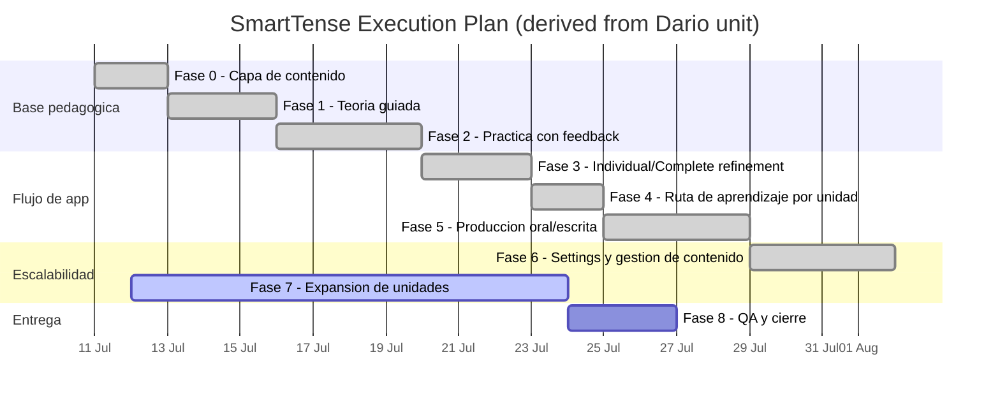

# Plan de Desarrollo Por Fases - SmartTense (v2)

Documento base: `DARIO _ GENERAL ENGLISH COURSE.docx` (A2, Unit 1: Verb tenses and daily habits), revisado y convertido a un plan incremental para SmartTense.

Fecha de referencia: 11/07/2026.

## 1) Resumen ejecutivo

La unidad de Dario ya tiene una estructura pedagógica completa para evolucionar SmartTense:

- objetivos claros por unidad;
- teoria por tiempo verbal;
- formulas y uso de los tiempos (Simple / Continuous / Perfect / Perfect Continuous);
- ejemplos contextualizados (IT, familia, rutina, trabajo, movimiento);
- errores tipicos de hispanohablantes;
- ejercicios de produccion y transformacion (fill in, corregir, escoger tiempo, traducir, speaking/writing);
- soporte adicional con preposiciones y vocabulario.

SmartTense ya tiene la mitad de la base tecnica: el motor de conjugacion, la UI de estudio y la gestion de contenido.
El siguiente nivel es convertirla en una experiencia de curso guiada por fases, sin romper el core:

- **fase 0-3:** estabilizar producto base de contenidos + teoria + practica;
- **fase 4-6:** consolidar flujo de aprendizaje + mejoras de experiencia;
- **fase 7-8+:** gobernanza de contenido (Settings), escala de datos y nuevas unidades.

---

## 2) Fases ejecutivas y tareas operativas

Cada fase incluye:
- objetivo ejecutivo (1 frase),
- tareas operativas (lista corta y accionable),
- criterio de salida.

### Fase 0 - Capa de contenido inteligente

**Objetivo ejecutivo:** Tener un modelo de contenido que permita transformar la unidad de Dario en un recurso consumible por SmartTense sin tocar codigo cada vez.

**Tareas operativas**
- Definir la taxonomia de `learningUnits` en JSON:
  - unidad, objetivo, secciones de teoria, errores, ejemplos, vocabulario, ejercicios, soporte (prepositions / speaking / writing).
- Cerrar validadores de schema para IDs, campos requeridos, tipos de ejercicios y referencias a tiempos.
- Diseñar convención de versionado y migracion simple del contenido.
- Añadir pruebas de integridad:
  - unicidad de IDs,
  - referencias cruzadas por tiempo/sujeto/contexto,
  - limites de tamano y formato de textos.

**Criterio de salida**
- `learningUnits.json` carga sin errores con esquema versionado.
- Errores de schema reportados de forma clara y consistente.
- Cobertura automatizada que rechace payload invalido.

---

### Fase 1 - Teoria guiada por unidad

**Objetivo ejecutivo:** Entregar en app la teoria accionable para iniciar el aprendizaje antes de practicar.

**Tareas operativas**
- En `Theory` mostrar secciones de la unidad:
  - objetivos de la unidad,
  - significado y uso,
  - keywords de seleccion de tiempo,
  - estructura por forma (aff/neg/inter/inter-neg),
  - errores tipicos y correcciones,
  - ejemplos con enfoque real (IT + rutina).
- Mantener version bilingue (en/es) en labels y ayudas.
- Hacer la seccion responsive y legible en mobile.
- Reutilizar componentes para evitar duplicacion entre Theory, Practice y Production.

**Criterio de salida**
- Un estudiante puede leer y comprender un tiempo desde la aplicacion sin consultar material externo.
- La teoria se mantiene editable desde JSON.

---

### Fase 2 - Practica formativa y retroalimentacion local

**Objetivo ejecutivo:** Transformar teoria en evidencia de aprendizaje con practica interactiva.

**Tareas operativas**
- Implementar tipos de ejercicio derivados de la unidad:
  - fillBlank,
  - transform,
  - chooseTense,
  - correctMistake,
  - translation ES->EN.
- Añadir normalizacion de respuestas:
  - trim, minusculas, contracciones y variantes comunes.
- Dar feedback inmediato con pista corta de razon.
- Guardar estado de avance por ejercicio y por unidad.

**Criterio de salida**
- Al completar una unidad, el usuario tiene evidencia de practica de al menos 3 tipos de ejercicio.
- Los resultados quedan locales y permites retomarlos sin perder contexto.

---

### Fase 3 - Flujo de conjugacion guiado (Individual + Complete)

**Objetivo ejecutivo:** Mantener el motor de practica rapida para repaso, y controlar la carga visual en mobile.

**Tareas operativas**
- Mantener `Individual` para practica afirmativa inicial.
- `Individual`:
  - seleccionar tiempos por grupos (Pasado / Presente / Futuro / Conditional),
  - seleccionar sujeto multiples,
  - boton "todos / ninguno" por grupo de tiempo y por sujeto.
- `Complete` con vista full pero filtrable:
  - columnas persistentes de usuario,
  - modo de comparacion rapida,
  - filtros por tiempo/sujeto.
- Revisar comportamiento de paginacion, orden y scroll para listas largas.

**Criterio de salida**
- Practica diaria posible en menos de 3 scrolls en mobile en escenarios de contenido normal.
- `Individual` no bloquea la UI cuando hay muchos filtros activos.

---

### Fase 4 - Ruta de aprendizaje y progresion por unidad

**Objetivo ejecutivo:** Guiar el aprendizaje con un recorrido claro: Home -> Theory -> Practice -> repaso.

**Tareas operativas**
- Enlazar Home con unidad activa y progreso por unidad.
- Definir estados simples: no iniciado, en progreso, practicamente completado.
- Sugerir siguiente accion en Home segun estado.
- Permitir reset de avance local por unidad de forma clara.

**Criterio de salida**
- Cada unidad muestra una ruta visual y accionable.
- El flujo recomendada evita ambiguedad (un click para volver al siguiente paso).

---

### Fase 5 - Produccion oral y escrita (Speaking/Writing)

**Objetivo ejecutivo:** Entrenar salida real en ingles (habla y escritura) conectado con la unidad actual.

**Tareas operativas**
- Crear set de prompts por unidad:
  - prompts de speaking por contexto,
  - prompts de writing por unidad.
- Permitir estados del intento (`draft`, `done`, `needsReview`, `approved`).
- Añadir feedback y notas del usuario.
- Guardar historial local para revisar y retomar.

**Criterio de salida**
- Usuario genera 1+ salida de speaking/writing por unidad con estado persistente.
- Revisar historial por modo y estado.

---

### Fase 6 - Settings como centro de control de contenido

**Objetivo ejecutivo:** Gestionar y escalar contenido sin editar archivos manualmente en cada iteracion.

**Tareas operativas**
- En `Settings`:
  - import/export de `learningUnits.json`,
  - preview de cambios y resumen de validacion,
  - import protegido por schema,
  - filtros y ordenamiento en la tabla de verbos/palabras.
- Hacer bulk-edit **opcional**:
  - mostrar tabla indexada (solo lectura),
  - modo de edicion masiva cuando se activa,
  - guardar cambios solo en modo bulk,
  - confirmacion explicita para guardar / eliminar / cancelar.
- Mejorar confirmaciones de acciones destructivas.

**Criterio de salida**
- Administrador puede actualizar contenido y exportar JSON valido.
- Las acciones delicadas requieren confirmacion de usuario.

---

### Fase 7 - Expansion de contenido y niveles

**Objetivo ejecutivo:** Expandir de manera controlada hacia nuevos bloques curriculares.

**Tareas operativas**
- Añadir nuevas unidades gradualmente:
  - Past + Future + Conditional (simple, perfect, continuous),
  - ejercicios de transferencia entre tiempos.
- Mantener consistencia de estructura con schema existente.
- Añadir soporte de vocabulario y soporte (prepositions) por unidad.
- Implementar mejoras de UX para listas largas (pagination, search, orden, filtros persistentes).

**Criterio de salida**
- Al menos una unidad adicional con teoria + practica + vocabulary + prepositions visible y funcional.
- Rendimiento estable al cargar datos mas amplios.

---

### Fase 8 - QA, metricas y cierre de hito

**Objetivo ejecutivo:** Cerrar cada fase con evidencia y calidad estable para producto real.

**Tareas operativas**
- Ejecutar:
  - `npm test`,
  - `npm run build`,
  - flujo completo manual en desktop + mobile (Home, Theory, Individual, Complete, Practice, Production, Settings).
- Revisar experiencia en mobile (densidad visual, scroll, botones).
- Registrar en `docs/PHASE_EXECUTION_LOG.md` decisiones y evidencias.

**Criterio de salida**
- Cero regresiones en pruebas automaticas.
- Flujo principal usable y estable en pantalla chica.

---

## 3) Gantt interno propuesto (6 fases por tramo)

> Nota: Fechas de Gantt son internas para planificacion y pueden ajustarse segun carga real y validacion de UX.

---

## 4) Recomendacion operativa para inicio (proximas 2 semanas)

1. Cerrar estabilidad de Fase 7 con la unidad `past-future-conditional-foundation` ya incorporada.
2. Ajustar `Settings` a flujo de edicion optional bulk con "confirmar cambios" y cancelacion clara.
3. Afinar `Home` y `Theory` para uso mobile rapido (menos scroll, mejor jerarquia visual).
4. Ejecutar suite completa y registrar evidencias en `PHASE_EXECUTION_LOG.md`.
5. Ajustar roadmap con fechas reales y preparar la siguiente unidad.

