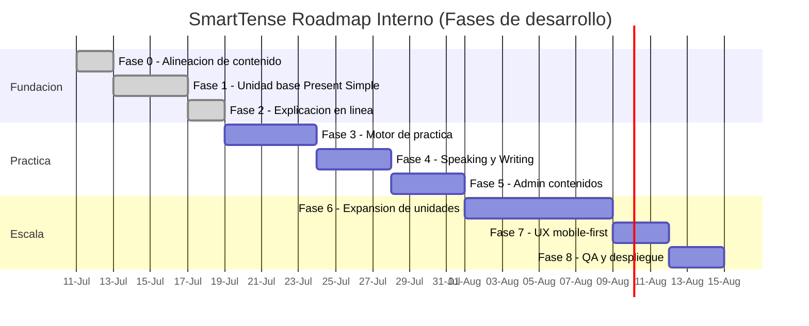

# Roadmap Ejecutivo y Operativo de SmartTense (base Dario Unit 1)

**Fuente:** `DARIO _ GENERAL ENGLISH COURSE.docx` (A2 English Level, Unit 1: *Verb tenses and daily habits*).  
**Fecha base:** `11/07/2026`.  
**Objetivo del documento:** convertir el contenido pedagogico en un plan de producto incremental, por fases ejecutivas y tareas operativas de desarrollo.

## Alcance de la referencia academica

El curso de Dario aporta:

- objetivos por unidad y criterio de logro;
- manejo de tiempos (afirmativo / negativo / interrogativo / interrogativo negativo);
- estructuras y reglas por caso;
- errores tipicos del hispanohablante;
- vocabulario tematico (IT, rutinas, familia, movimiento, preposiciones);
- ejercicios de completar, transformar, elegir tiempo, corregir errores y traducir ES->EN;
- tareas de speaking/writing como puente de produccion.

Con esto como base, la hoja de ruta propone un crecimiento progresivo de producto sin romper el stack actual.

---

## Fases ejecutivas y tareas operativas

### Fase 0 - Alineacion pedagogica y estructura de contenido

**Objetivo ejecutivo:** asegurar que el producto use una fuente de verdad unificada y no dependa de datos hardcoded.

**Tareas operativas**
- Diseñar y normalizar `public/data/learningUnits.json` para cubrir unidad, teoria, estructuras, ejercicios, errores, vocabulario y contexto.
- Extender `src/data/learningContentValidation.js` para validar unidades, secciones, ejercicios y metadatos.
- Actualizar `docs/LEARNING_CONTENT_SCHEMA.md` y pruebas de integridad.
- Definir convencion de versionado de contenido.

**Criterio de cierre**
- La app rechaza contenido invalido y carga una unidad base consistente.

---

### Fase 1 - Unidad base "Present Simple" completa

**Objetivo ejecutivo:** entregar un modulo de aprendizaje usable y consistente para el nivel inicial.

**Tareas operativas**
- Mapear del documento: objetivos, significado, usos y reglas basicas.
- Renderizar en `Theory`:
  - significado de forma;
  - reglas de uso;
  - estructuras (`Aff`, `Neg`, `Interrog`);
  - signos de uso y formas correctas;
  - errores comunes con correccion;
  - ejemplos y practica inicial.
- Cargar unidad en `learningUnits.json` con `contexts`, `signalWords`, `vocabulary`, `exercises`.

**Criterio de cierre**
- La unidad 1 funciona desde JSON sin codigo hardcoded.

---

### Fase 2 - Explicacion gramatical en linea

**Objetivo ejecutivo:** convertir la tabla de conjugaciones en una herramienta de aprendizaje explicativo.

**Tareas operativas**
- Enriquecer generacion de filas en `src/conjugation.js` con metadata (`subject`, `auxiliary`, `verbForm`, `reason`).
- Mostrar en `Complete` e `Individual` un panel `Why this form?`.
- Registrar y validar errores tipicos de forma automatica.

**Criterio de cierre**
- Cada forma visible explica por que se usa esa estructura.

---

### Fase 3 - Motor de practica funcional

**Objetivo ejecutivo:** permitir practicar con feedback inmediato y seguimiento.

**Tareas operativas**
- Implementar ejercicios base: fill in blank, transformacion, elegir tiempo, traduccion.
- Normalizar respuestas y calcular score local.
- Guardar progreso de unidad por `unitId`.
- Filtrar ejercicios por contexto/vocabulario.

**Criterio de cierre**
- El alumno responde ejercicios y recibe feedback inmediato.

---

### Fase 4 - Production guided y seguimiento

**Objetivo ejecutivo:** pasar de practica de regla a produccion comunicativa.

**Tareas operativas**
- Diseñar prompts de speaking y writing con estructura del documento.
- Guardar intentos localmente con estados (`draft`, `done`, `needsReview`, `approved`).
- Filtros de cola por estado y edicion con confirmacion.

**Criterio de cierre**
- Cada intento queda registrable, revisable y rastreable.

---

### Fase 5 - Administracion de contenido y mantenimiento

**Objetivo ejecutivo:** permitir mantenimiento de contenidos sin editar archivos JSON manualmente.

**Tareas operativas**
- Consolidar en `Settings` import/export de `learningUnits`.
- Validacion obligatoria antes de aplicar cambios.
- Tabla indexada, filtrada, ordenada y paginada para revision.
- Modo Bulk Edit opcional y acciones con confirmacion.

**Criterio de cierre**
- Cambios de contenido se preparan desde UI y se pueden exportar para actualizar repo.

---

### Fase 6 - Expansion de unidades de tiempo

**Objetivo ejecutivo:** escalar tiempos sin redisenar UI.

**Tareas operativas**
- Añadir la unidad de `past / future / conditional` con estructura equivalente.
- Reutilizar componentes de Theory/Practice/Complete.
- Incluir ejercicios de contraste entre tiempos.
- Ajustar Home para navegacion por unidad y recomendado siguiente paso.
- Mantener rendimiento con paginacion.

**Criterio de cierre**
- Al menos una unidad adicional operativa con progreso y practica completa.

---

### Fase 7 - UX mobile-first y consolidacion

**Objetivo ejecutivo:** reducir friccion visual y fatiga en dispositivos moviles.

**Tareas operativas**
- Compactar tarjetas y controles clave.
- Diseñar filtros y botones de accion con targets tocables.
- Revisar jerarquia visual y espaciado por flujo.
- Validar escenarios de uso continuo en mobile.

**Criterio de cierre**
- Menor scroll y menos toques para completar un bloque frecuente.

---

### Fase 8 - QA, evidencia y despliegue

**Objetivo ejecutivo:** cerrar cada etapa con evidencia verificable.

**Tareas operativas**
- Pruebas por flujo: `Home`, `Theory`, `Individual`, `Complete`, `Practice`, `Production`, `Settings`.
- Pruebas de regresion de import/export y rendimiento con dataset grande.
- Recolectar metricas basicas: tiempo a primera accion, tasa de finalizar unidad, tasa de retorno.
- Checklist de release + reporte final por fase.

**Criterio de cierre**
- Cada fase aprobada con `npm test`, `npm run build` y revision manual.

---

## Gantt interno sugerido

## Secuencia recomendada (incremental)

1. **Sprint 1 (7-10 dias):** Fases 0, 1 y 2 (establecer base pedagogica).
2. **Sprint 2 (5-7 dias):** Fase 3 y ajuste de feedback.
3. **Sprint 3 (5-7 dias):** Fase 4 y Fase 6.
4. **Sprint 4 (5 dias):** Fase 5 y Fase 7.
5. **Sprint 5 (2 dias):** Fase 8 y release.

## Dependencias claves

- `public/data/learningUnits.json`
- `src/data/learningContentValidation.js`
- `src/data/learningContentAdmin.js`
- `src/App.jsx`
- `src/conjugation.js`
- `src/data/productionPrompts.js`
- `docs/LEARNING_CONTENT_SCHEMA.md`
