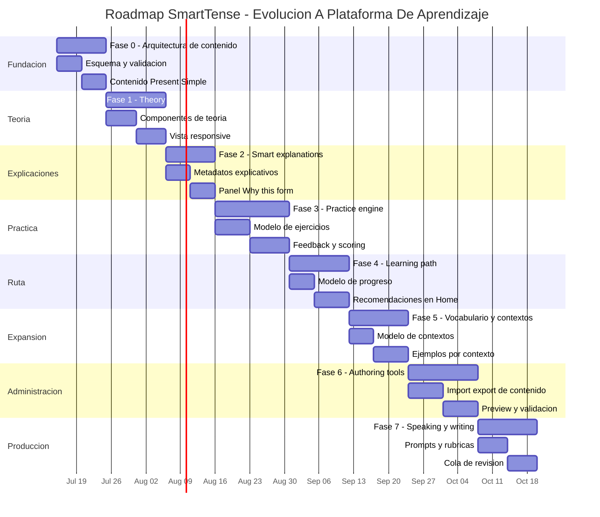

# SmartTense - Roadmap De Desarrollo Por Fases

Este documento convierte las ideas del curso de inglés revisado en un plan incremental para SmartTense. El curso muestra una dirección clara: SmartTense puede evolucionar de una tabla inteligente de conjugaciones hacia una experiencia guiada de aprendizaje, con teoría, explicaciones, ejemplos, ejercicios, vocabulario y práctica oral/escrita.

La intención no es copiar el curso dentro de la app, sino usar su estructura pedagógica para diseñar el siguiente nivel del producto.

## Lectura Ejecutiva Del Documento Fuente

El documento revisado trabaja un nivel A2 y combina:

- Objetivos claros por unidad.
- Teoría gramatical por tiempo verbal.
- Estructuras afirmativas, negativas, interrogativas e interrogativas negativas.
- Respuestas cortas, reglas ortográficas, palabras señal y errores comunes.
- Ejemplos contextualizados en trabajo de IT, familia, rutinas, escuela/trabajo, vacaciones y movimiento.
- Ejercicios de completar, transformar, elegir tiempo correcto, corregir errores, traducir de español a inglés y practicar speaking.
- Temas de soporte que amplían el valor de SmartTense: preposiciones, vocabulario diario y tareas guiadas de speaking/writing.

La oportunidad principal es que SmartTense ya genera estructuras. El siguiente paso es explicar por qué funcionan y convertirlas en práctica guiada.

## Dirección Del Producto

SmartTense debería evolucionar hacia un espacio de aprendizaje estructurado:

- `Home`: progreso, recomendaciones y siguiente actividad.
- `Theory`: teoría corta, reglas, ejemplos y errores comunes.
- `Individual`: práctica enfocada, inicialmente afirmativa.
- `Complete`: comparación completa de formas.
- `Practice`: ejercicios interactivos generados desde datos.
- `Settings`: configuración y administración de datos/contenido.

Principio clave: cada nueva capacidad debe apoyarse en el motor gramatical y el modelo de datos existente. Evitar crear un visor estático de curso separado de SmartTense.

## Fases Ejecutivas Y Tareas Operativas

### Fase 0 - Arquitectura De Contenido

Objetivo ejecutivo:

Crear la base para que SmartTense pueda manejar teoría, ejemplos, ejercicios, vocabulario y unidades de aprendizaje como datos estructurados.

Tareas operativas:

- Diseñar un esquema JSON para `learningUnits`.
- Definir entidades: unidad, sección, objetivo, nota gramatical, estructura, ejemplo, ejercicio, vocabulario y contexto.
- Conectar el contenido con `tenseId`, `subjectId`, `verbId`, idioma de interfaz e idioma del estudiante.
- Crear validación similar a `src/data/validation.js`.
- Crear contenido mínimo para Present Simple.
- Agregar pruebas de validación.
- Documentar el esquema en `docs/LEARNING_CONTENT_SCHEMA.md`.

Entregable:

- SmartTense puede cargar una unidad de aprendizaje desde JSON y rechazar contenido inválido.

### Fase 1 - Sección Theory

Objetivo ejecutivo:

Permitir que el usuario lea teoría breve antes de practicar.

Tareas operativas:

- Agregar sección o página `Theory`.
- Crear componentes reutilizables:
  - objetivos de lección;
  - explicación del tiempo verbal;
  - estructuras;
  - palabras señal;
  - errores comunes;
  - ejemplos.
- Renderizar contenido desde JSON, no hard-coded.
- Conectar teoría con grupos de tiempos existentes.
- Agregar textos de interfaz en inglés/español.
- Diseñar layout responsive para móvil.
- Actualizar documentación.

Entregable:

- Present Simple tiene una vista de teoría navegable desde la app.

### Fase 2 - Explicaciones Inteligentes

Objetivo ejecutivo:

Hacer que SmartTense explique cómo se construye una oración, no solo mostrarla.

Tareas operativas:

- Extender las filas generadas con metadatos explicativos:
  - sujeto;
  - auxiliar;
  - forma verbal;
  - complemento;
  - motivo del tiempo verbal;
  - forma afirmativa/negativa/interrogativa.
- Agregar panel `Why this form?`.
- Explicar errores comunes como `He doesn't works`.
- Agregar explicaciones en el idioma del estudiante cuando existan.
- Agregar pruebas para helpers de explicación.

Entregable:

- El usuario puede abrir una oración y ver una explicación clara de su estructura.

### Fase 3 - Motor De Práctica

Objetivo ejecutivo:

Convertir SmartTense en una herramienta activa de práctica.

Tareas operativas:

- Crear página `Practice`.
- Implementar tipos de ejercicio:
  - completar espacios;
  - escoger el tiempo correcto;
  - corregir errores;
  - transformar afirmativa a negativa/interrogativa;
  - traducción español -> inglés;
  - respuestas cortas.
- Crear normalización de respuestas.
- Agregar feedback inmediato.
- Guardar progreso local.
- Generar ejercicios desde verbos, sujetos, tiempos y plantillas.
- Agregar pruebas para scoring y validación de respuestas.

Entregable:

- Present Simple tiene al menos tres tipos de ejercicios funcionales con feedback.

### Fase 4 - Ruta De Aprendizaje

Objetivo ejecutivo:

Organizar el aprendizaje en una secuencia guiada.

Tareas operativas:

- Agregar estado de unidad: no iniciada, en progreso, completada.
- Agregar flujo: teoría -> ejemplos -> práctica -> revisión.
- Actualizar Home para recomendar la siguiente actividad.
- Crear unidades iniciales:
  - Unidad 1: Present tenses and daily habits.
  - Unidad 2: Past tenses.
  - Unidad 3: Future and conditional.
  - Unidad 4: Prepositions and movement.
  - Unidad 5: Speaking and writing tasks.
- Agregar criterios locales de completitud.
- Agregar reset de progreso por unidad en Settings.

Entregable:

- Home puede recomendar el siguiente paso del usuario dentro de una unidad.

### Fase 5 - Vocabulario Y Contextos

Objetivo ejecutivo:

Hacer que SmartTense genere ejemplos más cercanos a la vida real del estudiante.

Tareas operativas:

- Crear paquetes de vocabulario:
  - IT work;
  - daily habits;
  - family routines;
  - meetings;
  - travel/vacation;
  - prepositions of time/place/direction.
- Conectar vocabulario con complementos y ejercicios.
- Agregar filtros por contexto.
- Agregar tarjetas simples de vocabulario.
- Permitir import/export de vocabulary packs desde Settings.
- Agregar validaciones y pruebas.

Entregable:

- El usuario puede escoger un contexto y ver ejemplos/prácticas adaptadas a ese contexto.

### Fase 6 - Administración De Contenido

Objetivo ejecutivo:

Permitir crecer el contenido sin editar archivos JSON manualmente todo el tiempo.

Tareas operativas:

- Extender Settings para administrar:
  - verbos;
  - unidades;
  - teoría;
  - ejercicios;
  - vocabulario.
- Agregar import/export por tipo de contenido.
- Agregar vista previa antes de guardar.
- Agregar validación con resumen de errores.
- Agregar bulk edit para metadatos de contenido.
- Crear documentación para autores de contenido.

Entregable:

- Un administrador puede editar contenido de aprendizaje, validarlo y exportarlo como JSON.

### Fase 7 - Speaking, Writing Y Revisión

Objetivo ejecutivo:

Soportar práctica de producción, que es donde el estudiante realmente gana fluidez.

Tareas operativas:

- Crear tarjetas de speaking prompts.
- Crear tarjetas de writing prompts.
- Agregar rúbricas simples de autoevaluación.
- Agregar drills con temporizador.
- Guardar intentos localmente.
- Agregar notas del estudiante o profesor.
- Crear cola de revisión para errores frecuentes.

Entregable:

- El usuario puede completar una tarea corta de speaking/writing y guardarla para revisión.

## Gantt Interno

Fechas internas de referencia. Se pueden ajustar según prioridad, tiempo disponible y feedback del usuario.

## Releases Sugeridos

### Release 1 - Theory MVP

- Fase 0 completa.
- Fase 1 solo con Present Simple.
- Sin motor de práctica todavía.

### Release 2 - Explain The Sentence

- Fase 2 para Present Simple, Present Continuous y Present Perfect Simple.
- Explicaciones visibles desde Individual y Complete.

### Release 3 - Practice MVP

- Fase 3 con completar espacios, transformar oración y elegir tiempo correcto.
- Scoring local.

### Release 4 - Course Mode

- Fase 4 con flujo de Unidad 1.
- Home recomienda la siguiente actividad.

### Release 5 - Content Scale

- Bases de Fase 5 y Fase 6.
- Vocabulario por contexto e import/export de contenido.

## Primera Implementación Recomendada

Empezar pequeño:

1. Crear `public/data/learningUnits.json`.
2. Crear `src/data/learningContentValidation.js`.
3. Agregar una unidad de teoría para Present Simple.
4. Agregar `Theory` al menú.
5. Renderizar objetivos, explicación, estructuras, palabras señal, errores comunes y ejemplos.
6. Dejar ejercicios interactivos para una fase posterior.

Este primer paso da una nueva dirección al producto sin tocar demasiado el motor de conjugación existente.

