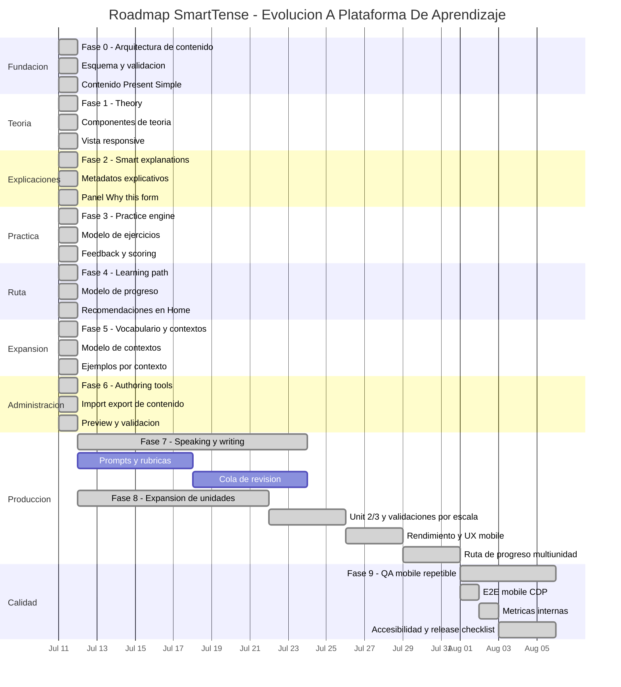

# SmartTense - Roadmap De Desarrollo Por Fases

Este documento convierte las ideas del curso de ingles revisado en un plan incremental para SmartTense. La direccion del producto es clara: evolucionar de una tabla inteligente de conjugaciones hacia una experiencia guiada de aprendizaje, con teoria, explicaciones, ejemplos, ejercicios, vocabulario y practica oral/escrita.

La version ejecutiva + operativa detallada esta en [DEVELOPMENT_PHASE_EXECUTION_PLAN.md](DEVELOPMENT_PHASE_EXECUTION_PLAN.md).  
Para la version recomendada con fases ejecutivas y tareas operativas derivadas del documento adjunto, ver:

- [PROJECT_PHASE_EXECUTION_PLAN_FROM_DARIO.md](PROJECT_PHASE_EXECUTION_PLAN_FROM_DARIO.md).
- [SMARTTENSE_PHASE_PLAN_DARIO_INCREMENTAL.md](SMARTTENSE_PHASE_PLAN_DARIO_INCREMENTAL.md) (versión nueva, más compacta y operativa, con Gantt interno).
- [PHASE_PLAN_DARIO_UNIT1_BY_OPERATIONS.md](PHASE_PLAN_DARIO_UNIT1_BY_OPERATIONS.md) (nuevo documento con fases ejecutivas + tareas operativas y Gantt interno derivado del docx).

La intencion no es copiar el curso dentro de la app, sino usar su estructura pedagogica para disenar el siguiente nivel del producto.

## Estado Ejecutivo De Fases

| Fase | Estado | Entregable actual | Evidencia |
| --- | --- | --- | --- |
| Fase 0 - Arquitectura de contenido | Cerrada | `public/data/learningUnits.json`, validador, pruebas y esquema documentado | `npm test` con validacion de contenido |
| Fase 1 - Theory | Cerrada | Pagina Theory renderizada desde JSON, enlazada desde Home y menu | `npm test`, `npm run build`; navegador interno no disponible para captura automatizada |
| Fase 2 - Explicaciones inteligentes | Cerrada | Panel compacto `Why this form?` con patron, razon, auxiliar y forma verbal | `npm test`, `npm run build` |
| Fase 3 - Motor de practica | Cerrada | Pagina Practice con ejercicios iniciales, scoring local y feedback inmediato | `npm test`, `npm run build` |
| Fase 4 - Ruta de aprendizaje | Cerrada | Progreso local por unidad y Home recomienda el siguiente paso | `npm test`, `npm run build` |
| Fase 5 - Vocabulario y contextos | Cerrada | Contextos, vocabulario y practica filtrable por contexto | `npm test`, `npm run build` |
| Fase 6 - Administracion de contenido | Cerrada | Import/export, preview y validacion de contenido de aprendizaje en Settings | `npm test`, `npm run build` |
| Fase 7 - Speaking, writing y revision | Cerrada | Workspace Production con speaking/writing, estado de intento y filtros | `src/data/productionPrompts.js`, `App.jsx`, `src/i18n.js` |
| Fase 8 - Expansión de unidades de tiempo | Cerrada | Unidad past/future/conditional, ejercicios de transferencia y Production alineado | `npm test`, `npm run build`, smoke mobile CDP y QA alto volumen con 500 verbos |
| Fase 9 - Calidad, metricas y robustez | Cerrada | E2E mobile repetible, quality gates, accesibilidad basica y release checklist | `npm run test:e2e:mobile` |

## Lectura Ejecutiva Del Documento Fuente

El documento revisado trabaja un nivel A2 y combina:

- Objetivos claros por unidad.
- Teoria gramatical por tiempo verbal.
- Estructuras afirmativas, negativas, interrogativas e interrogativas negativas.
- Respuestas cortas, reglas ortograficas, palabras senal y errores comunes.
- Ejemplos contextualizados en trabajo de IT, familia, rutinas, escuela/trabajo, vacaciones y movimiento.
- Ejercicios de completar, transformar, elegir tiempo correcto, corregir errores, traducir de espanol a ingles y practicar speaking.
- Temas de soporte que amplian el valor de SmartTense: preposiciones, vocabulario diario y tareas guiadas de speaking/writing.

La oportunidad principal es que SmartTense ya genera estructuras. El siguiente paso es explicar por que funcionan y convertirlas en practica guiada.

## Direccion Del Producto

SmartTense deberia evolucionar hacia un espacio de aprendizaje estructurado:

- `Home`: progreso, recomendaciones y siguiente actividad.
- `Theory`: teoria corta, reglas, ejemplos y errores comunes.
- `Individual`: practica enfocada, inicialmente afirmativa.
- `Complete`: comparacion completa de formas.
- `Practice`: ejercicios interactivos generados desde datos.
- `Settings`: configuracion y administracion de datos/contenido.

Principio clave: cada nueva capacidad debe apoyarse en el motor gramatical y el modelo de datos existente. Evitar crear un visor estatico de curso separado de SmartTense.

## Fases Ejecutivas Y Tareas Operativas

### Fase 0 - Arquitectura De Contenido

Objetivo ejecutivo:

Crear la base para que SmartTense pueda manejar teoria, ejemplos, ejercicios, vocabulario y unidades de aprendizaje como datos estructurados.

Tareas operativas:

- Disenar un esquema JSON para `learningUnits`.
- Definir entidades: unidad, seccion, objetivo, nota gramatical, estructura, ejemplo, ejercicio, vocabulario y contexto.
- Conectar el contenido con `tenseIds`, idioma de interfaz e idioma del estudiante.
- Crear validacion similar a `src/data/validation.js`.
- Crear contenido minimo para Present Simple.
- Agregar pruebas de validacion.
- Documentar el esquema en `docs/LEARNING_CONTENT_SCHEMA.md`.

Entregable:

- SmartTense puede cargar una unidad de aprendizaje desde JSON y rechazar contenido invalido.

Estado:

- Cerrada. Existe una unidad `present-simple-foundation`, un validador dedicado, pruebas automatizadas y documentacion del esquema.

### Fase 1 - Seccion Theory

Objetivo ejecutivo:

Permitir que el usuario lea teoria breve antes de practicar.

Tareas operativas:

- Agregar seccion o pagina `Theory`.
- Crear componentes reutilizables: objetivos, explicacion del tiempo verbal, estructuras, palabras senal, errores comunes y ejemplos.
- Renderizar contenido desde JSON, no hard-coded.
- Conectar teoria con grupos de tiempos existentes.
- Agregar textos de interfaz en ingles/espanol.
- Disenar layout responsive para movil.
- Actualizar documentacion.

Entregable:

- Present Simple tiene una vista de teoria navegable desde la app.

Estado:

- Cerrada. Theory carga `public/data/learningUnits.json`, valida el contenido, renderiza la unidad Present Simple y muestra objetivos, teoria, estructuras, palabras senal, errores comunes, ejemplos y vista previa de ejercicios.

### Fase 2 - Explicaciones Inteligentes

Objetivo ejecutivo:

Hacer que SmartTense explique como se construye una oracion, no solo mostrarla.

Tareas operativas:

- Extender las filas generadas con metadatos explicativos: sujeto, auxiliar, forma verbal, complemento, motivo del tiempo verbal y tipo de forma.
- Agregar panel `Why this form?`.
- Explicar errores comunes como `He doesn't works`.
- Agregar explicaciones en el idioma del estudiante cuando existan.
- Agregar pruebas para helpers de explicacion.

Entregable:

- El usuario puede abrir una oracion y ver una explicacion clara de su estructura.

Estado:

- Cerrada. Las filas generadas incluyen `explanations` por forma, y la UI muestra un panel desplegable `Why this form?` en Complete, tarjetas moviles e Individual.

### Fase 3 - Motor De Practica

Objetivo ejecutivo:

Convertir SmartTense en una herramienta activa de practica.

Tareas operativas:

- Crear pagina `Practice`.
- Implementar ejercicios de completar espacios, escoger tiempo correcto, corregir errores, transformar formas, traducir espanol -> ingles y respuestas cortas.
- Crear normalizacion de respuestas.
- Agregar feedback inmediato.
- Guardar progreso local.
- Generar ejercicios desde verbos, sujetos, tiempos y plantillas.
- Agregar pruebas para scoring y validacion de respuestas.

Entregable:

- Present Simple tiene al menos tres tipos de ejercicios funcionales con feedback.

Estado:

- Cerrada para MVP. Practice renderiza ejercicios desde `learningUnits`, permite escribir respuestas, normaliza/scoring localmente y muestra feedback inmediato. El contenido inicial incluye completar y transformar; mas tipos quedan para iteraciones posteriores de Practice.

### Fase 4 - Ruta De Aprendizaje

Objetivo ejecutivo:

Organizar el aprendizaje en una secuencia guiada.

Tareas operativas:

- Agregar estado de unidad: no iniciada, en progreso, completada.
- Agregar flujo: teoria -> ejemplos -> practica -> revision.
- Actualizar Home para recomendar la siguiente actividad.
- Crear unidades iniciales para presente, pasado, futuro/condicional, preposiciones y speaking/writing.
- Agregar criterios locales de completitud.
- Agregar reset de progreso por unidad en Settings.

Entregable:

- Home puede recomendar el siguiente paso del usuario dentro de una unidad.

Estado:

- Cerrada para MVP. La app guarda progreso local por unidad, marca Theory como visto, marca Practice como completado al responder correctamente todos los ejercicios, recomienda el siguiente paso en Home y permite resetear la unidad desde Settings.

### Fase 5 - Vocabulario Y Contextos

Objetivo ejecutivo:

Hacer que SmartTense genere ejemplos mas cercanos a la vida real del estudiante.

Tareas operativas:

- Crear paquetes de vocabulario: IT work, daily habits, family routines, meetings, travel/vacation y prepositions.
- Conectar vocabulario con complementos y ejercicios.
- Agregar filtros por contexto.
- Agregar tarjetas simples de vocabulario.
- Permitir import/export de vocabulary packs desde Settings.
- Agregar validaciones y pruebas.

Entregable:

- El usuario puede escoger un contexto y ver ejemplos/practicas adaptadas a ese contexto.

Estado:

- Cerrada para MVP. Existe un catalogo de contextos en `public/data/learningUnits.json`, Theory y Practice comparten un filtro compacto por contexto, Theory muestra vocabulario contextual y Practice filtra ejercicios por la situacion seleccionada. Import/export de vocabulario queda para Fase 6 como parte de administracion de contenido.

### Fase 6 - Administracion De Contenido

Objetivo ejecutivo:

Permitir crecer el contenido sin editar archivos JSON manualmente todo el tiempo.

Tareas operativas:

- Extender Settings para administrar verbos, unidades, teoria, ejercicios y vocabulario.
- Agregar import/export por tipo de contenido.
- Agregar vista previa antes de guardar.
- Agregar validacion con resumen de errores.
- Agregar bulk edit para metadatos de contenido.
- Crear documentacion para autores de contenido.

Entregable:

- Un administrador puede editar contenido de aprendizaje, validarlo y exportarlo como JSON.

Estado:

- Cerrada para MVP. Settings incluye un administrador compacto de contenido de aprendizaje: importa JSON compatible como borrador, valida con `validateLearningContent`, muestra vista previa de unidades/contextos/vocabulario/ejercicios, aplica el contenido a Theory/Practice con confirmacion y exporta JSON para actualizar `public/data/learningUnits.json`. La edicion visual campo por campo queda para iteraciones posteriores si el volumen de contenido lo exige.

### Fase 7 - Speaking, Writing Y Revision

Objetivo ejecutivo:

Soportar practica de produccion, que es donde el estudiante realmente gana fluidez.

Tareas operativas:

- Crear tarjetas de speaking prompts.
- Crear tarjetas de writing prompts.
- Agregar rubricas simples de autoevaluacion.
- Agregar drills con temporizador.
- Guardar intentos localmente.
- Agregar notas del estudiante o profesor.
- Crear cola de revision para errores frecuentes.

Entregable:

- El usuario puede completar una tarea corta de speaking/writing y guardarla para revision.

Estado:

- Cerrada para MVP. Production está activo con:
  - prompts iniciales (hablar y escribir),
  - intentos en cola con estados `draft`, `done`, `needsReview`, `approved`,
  - filtros por modo y estado,
  - registro local y edición de notas,
  - confirmación al editar/eliminar.

### Fase 8 - Expansion De Unidades

Objetivo ejecutivo:

Extender la ruta de aprendizaje a nuevos tiempos y unidades sin reconstruir la arquitectura actual.

Tareas operativas:

- Diseñar nueva unidad pedagógica para past/future/conditional usando el mismo schema de `learningUnits`.
- Consolidar patrones de ejercicios de transferencia entre tiempos.
- Reutilizar la lógica de contextos, filtros y progreso por unidad ya construida.
- Mantener rendimiento con tablas, paginación y filtrado para alta escala de contenido.

Estado:

- Cerrada. La unidad adicional, los ejercicios de transferencia, Production y la validacion mobile/alto volumen quedaron documentados en `docs/PHASE_EXECUTION_LOG.md`.

### Fase 9 - Calidad, Metricas Y Robustez

Objetivo ejecutivo:

Convertir los recorridos criticos de la app en evidencia repetible y medible, sin agregar features fuera del MVP.

Tareas operativas:

- Mantener un smoke E2E mobile ejecutable desde npm.
- Validar Home, Theory, Practice, Individual, Complete, Production y Settings en viewport mobile.
- Simular alto volumen con 500 verbos, que es el limite actual del validador.
- Definir metricas y umbrales internos para proximos cierres.
- Preparar checklist de release interna por pantalla.

Estado:

- Cerrada. F9a, F9b y F9c estan entregadas con `npm run test:e2e:mobile`, quality gates internos, checks de accesibilidad basica y `docs/RELEASE_CHECKLIST.md`. No se agrega virtualizacion mientras el limite actual siga en 500 verbos y el smoke mobile pase.

## Gantt Interno

Fechas internas de referencia. Se pueden ajustar segun prioridad, tiempo disponible y feedback del usuario.

## Releases Sugeridos

### Release 1 - Theory MVP

- Fase 0 completa.
- Fase 1 solo con Present Simple.
- Sin motor de practica todavia.

### Release 2 - Explain The Sentence

- Fase 2 para Present Simple, Present Continuous y Present Perfect Simple.
- Explicaciones visibles desde Individual y Complete.

### Release 3 - Practice MVP

- Fase 3 con completar espacios, transformar oracion y elegir tiempo correcto.
- Scoring local.

### Release 4 - Course Mode

- Fase 4 con flujo de Unidad 1.
- Home recomienda la siguiente actividad.

### Release 5 - Content Scale

- Bases de Fase 5 y Fase 6.
- Vocabulario por contexto e import/export de contenido.

## Siguiente Implementacion Recomendada

Continuar con la siguiente fase:

1. Definir la siguiente fase de producto antes de abrir trabajo nuevo fuera del MVP actual.

Este paso debe convertir la plataforma multiunidad en un flujo medible y repetible, sin cambiar el modelo tecnico actual.
