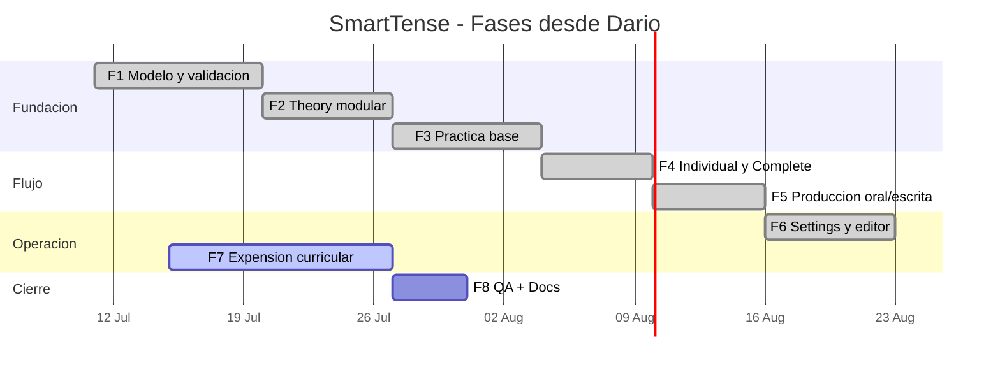

# Plan de Desarrollo por Fases - SmartTense (Base Dario)

Documento base: `DARIO _ GENERAL ENGLISH COURSE.docx` (A2, Unit 1).

Objetivo:
Transformar la unidad de Dario en un plan de producto incremental: teoria,
practica, speaking/writing y administracion de contenidos, listo para escalar.

## Base del contenido del documento

La unidad se puede organizar en 6 bloques:

1. Aprendizaje guiado: objetivos, definicion, uso por tiempo y palabras clave.
2. Gramatica operativa: afirmativa, negativa, interrogativa, interrogativa negativa.
3. Errores tipicos: correcciones claras para hispanohablantes.
4. Practica: fill in, transformar, elegir tiempo, corregir, traducir.
5. Hablar y escribir: prompts por sesion.
6. Soporte: preposiciones y vocabulario de rutinas.

## Fase 1 - Modelo de contenido y validacion

### Fase ejecutivo
Tener una base de contenido estable para activar unidades sin cambiar codigo.

### Tareas operativas
- Disenar estructura en `public/data/learningUnits.json`:
  - `lessonObjectives`
  - `grammarModules`
  - `commonErrors`
  - `examples`
  - `exercises`
  - `vocabulary`
  - `support`
- Definir schema de validacion para IDs y tipos.
- Expandir `src/data/learningContentValidation.js`.
- Probar integridad:
  - ids unicos
  - cardinalidad de campos
  - referencias cruzadas validas.
- Incluir pruebas automatizadas de regresion por schema.

## Fase 2 - Theory modular

### Fase ejecutivo
Que Theory entregue una leccion corta y accionable en secuencia:
objetivo -> regla -> ejemplo.

### Tareas operativas
- Renderizar bloques:
  - objetivos
  - uso y contexto
  - estructuras por forma
  - ejemplos y errores tipicos
- Soporte de secciones plegables para mobile.
- Filtros por contexto sin cortar el flujo.

## Fase 3 - Practica basica con feedback

### Fase ejecutivo
Cerrar el ciclo entre teoria y practica.

### Tareas operativas
- Implementar tipos de ejercicio:
  - llenar espacios
  - transformar
  - elegir tiempo
  - corregir error
  - traducir ES->EN
- Normalizacion de respuestas y scoring local.
- Guardar progreso parcial por sesion y unidad en localStorage.

## Fase 4 - Flujo Individual + Complete

### Fase ejecutivo
Reducir ruido visual y mejorar velocidad en mobile.

### Tareas operativas
- Mantener Individual en afirmativa para inicio rapido.
- Controles de sujeto y tiempo con seleccion multiple.
- Botones "todos / ninguno" por grupo.
- Complete con columnas configurables persistentes.
- Busqueda, orden, paginacion y paginador.

## Fase 5 - Produccion oral y escrita

### Fase ejecutivo
Completar practica productiva conectada a teoria.

### Tareas operativas
- Prompt sets por unidad para speaking y writing.
- Estados de intento (`draft`, `done`, `needsReview`).
- Edicion/cancelacion con confirmacion.

## Fase 6 - Settings y gobernanza

### Fase ejecutivo
Gestionar contenido sin tocar codigo.

### Tareas operativas
- Import/Export de verbos y learning units.
- Preview de cambios y validacion previa a aplicar.
- Bulk Edit opcional:
  - vista de tabla indexada
  - modo de edicion por lote
  - boton Actualizar solo en modo bulk
  - confirmacion antes de actualizar/eliminar.
- Cancelacion de cambios no aplicados.

## Fase 7 - Expansion curricular (Past / Future / Conditional)

### Fase ejecutivo
Escalar a nuevos tiempos sin romper la arquitectura.

### Tareas operativas
- Crear unidad en JSON con:
  - bloques gramaticales por tiempo
  - errores y practicas de transferencia
  - ejercicios de contraste.
- Reutilizar Theory/Practice sin cambios de motor.
- Optimizar listas largas: filtros, orden y paginacion.

## Fase 8 - Cierre y QA

### Fase ejecutivo
Entregar una version estable y trazable.

### Tareas operativas
- Ejecutar: `npm test` y `npm run build`.
- QA manual: Home, Theory, Individual, Complete, Production, Settings.
- Actualizar:
  - `docs/USER_GUIDE.md`
  - `docs/DEVELOPER_GUIDE.md`
  - `docs/PROJECT_PHASE_ROADMAP.md`
  - `docs/PHASE_EXECUTION_LOG.md`
- Cerrar evidencia por fase.

## Gantt interno recomendado

## KPIs por fase

- Estudio en mobile en menos de 2 pantallas de scroll por flujo.
- Al menos 1 ruta completada con evidencia por fase.
- 0 regresiones en `npm test` y `npm run build`.
- Navegacion sin degradacion al escalar contenido.

## Dependencias criticas

- F7 depende de F1 y F3 cerradas.
- F6 depende de F1 y F2.
- F4/F5 validan usabilidad en mobile antes de F7.
